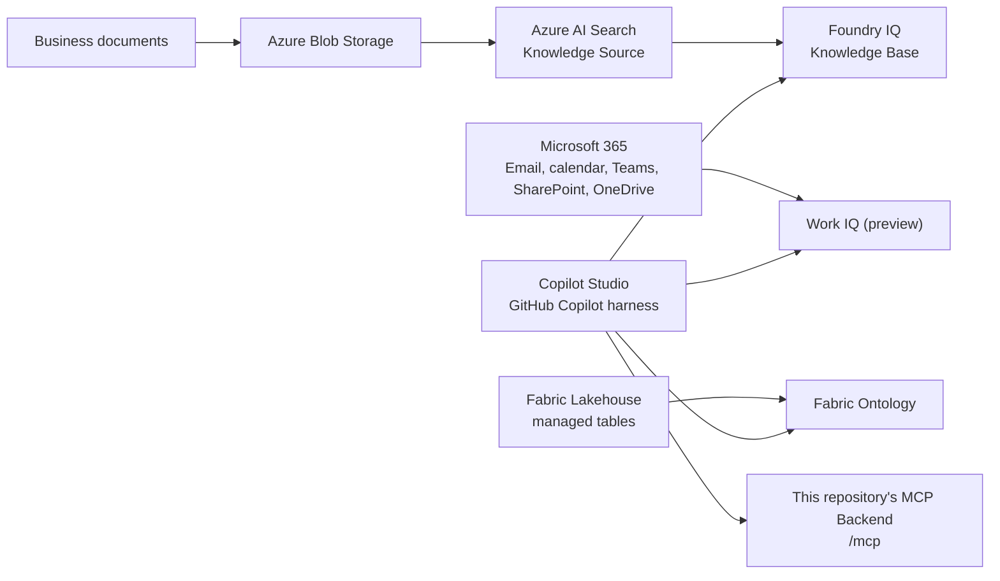

# Production Environment Setup Guide

[](https://github.com/TK3214-MS/POC-Harness-CustomIQ/blob/main/docs/Production-Environment-Setup.md) [](https://github.com/TK3214-MS/POC-Harness-CustomIQ/blob/main/docs/Production-Environment-Setup.en.md)

This guide is the single setup procedure for connecting Fabric IQ, Foundry IQ, Work IQ, and this repository's MCP Backend, with the GitHub Copilot harness in Microsoft Copilot Studio serving as the orchestration layer.

**Important**: Copilot Studio Tools directly handle data retrieval from Fabric IQ, Foundry IQ, and Work IQ. This repository's IQ Adapters, `LiveAdapterSettings`, and `WORK_IQ_*` / `FOUNDRY_IQ_*` / `FABRIC_IQ_*` environment variables are not used in this architecture.

## 1. Architecture and Work Sequence



Perform the work in the following order.

1. Confirm billing, tenant, permissions, and region
2. Configure the Lakehouse and Ontology in Fabric
3. Configure the Knowledge Source and Knowledge Base in Foundry/Azure AI Search
4. Prepare the tenant, billing, policies, and test Microsoft 365 data for Work IQ
5. Connect the three IQ Tools and this repository's MCP Backend in Copilot Studio
6. Validate each Tool independently, and then validate the business scenarios

## 2. Prerequisites

### 2.1 Required Environment

- Microsoft Entra tenant
- An environment where the GitHub Copilot harness in Copilot Studio is available
- Microsoft Fabric workspace and Fabric-supported capacity
- Azure subscription
- Azure AI Search service
- Azure Storage account (when using a Blob Knowledge Source for Foundry IQ)
- Microsoft Foundry project (when connecting Azure AI Search as Knowledge)
- A Global Administrator who can enable Work IQ
- Usage-based billing for Copilot Credits and a spending policy for Work IQ

Because product Preview status, pricing, regions, and billing conditions may change, review the official information current at the time of setup.

- [Copilot Studio harnesses](https://learn.microsoft.com/en-us/microsoft-copilot-studio/harnesses-overview)
- [Enable your tenant for Work IQ](https://learn.microsoft.com/en-us/microsoft-365/copilot/extensibility/work-iq/enable-work-iq)
- [Work IQ in Copilot Studio (preview)](https://learn.microsoft.com/en-us/microsoft-copilot-studio/add-work-iq)

### 2.2 Prepare the Repository

Only when deploying the MCP Backend to Azure, obtain this repository and validate its development dependencies.

```bash
git clone <repository-url>
cd POC-Harness-CustomIQ
python3 -m venv .venv
source .venv/bin/activate
pip install -e ".[dev]"
ruff check .
pytest tests/
```

This procedure validates the repository's MCP Backend. It is not a procedure for configuring Python Adapters to connect Fabric, Foundry, or Work IQ.

### 2.3 Optional: Industry-Specific Sample Data

You can verify an empty SaaS environment and its Copilot Studio connection without loading sample data. To validate response content, use the `sample-data/` directory in each Industry Pack. All data is synthetic and contains no information about real individuals, companies, patients, customers, accounts, residents, or employees.

| Industry | CSV for Fabric ingestion | Knowledge for Foundry | M365 templates for Work IQ |
| --- | --- | --- | --- |
| Manufacturing | `industry-packs/manufacturing/sample-data/fabric/quality_issues.csv` | `industry-packs/manufacturing/knowledge/` (8 documents) | `industry-packs/manufacturing/sample-data/work-iq/` (4 records) |
| Financial Services | `industry-packs/financial-services/sample-data/fabric/fraud_cases.csv` | `industry-packs/financial-services/knowledge/` (8 documents) | `industry-packs/financial-services/sample-data/work-iq/` (4 records) |
| Retail | `industry-packs/retail/sample-data/fabric/inventory_records.csv` | `industry-packs/retail/knowledge/` (8 documents) | `industry-packs/retail/sample-data/work-iq/` (4 records) |
| Healthcare | `industry-packs/healthcare/sample-data/fabric/encounters.csv` | `industry-packs/healthcare/knowledge/` (8 documents) | `industry-packs/healthcare/sample-data/work-iq/` (4 records) |
| Public Sector | `industry-packs/public-sector/sample-data/fabric/cases.csv` | `industry-packs/public-sector/knowledge/` (8 documents) | `industry-packs/public-sector/sample-data/work-iq/` (4 records) |

Ingest sample data separately for each industry. If multiple industries coexist in one Knowledge Base, ensure that Knowledge Source names, search instructions, and citations can be identified by industry.

### 2.4 Enterprise-Scale Samples

Each Pack provides enterprise-scale CSV files reproducible from the existing generator and a prompt library containing 10 prompts for each of 5 industry scenarios, for a total of 50 prompts.

| Industry | Enterprise CSV | Foundry JSONL | Prompt library | Approximate record volume |
| --- | --- | --- | --- | --- |
| Manufacturing | `sample-data/fabric/enterprise/` | `sample-data/foundry/enterprise/records.jsonl` | `sample-data/prompts/enterprise_prompts.yaml` | Approximately 23,000 rows |
| Financial Services | `sample-data/fabric/enterprise/` | `sample-data/foundry/enterprise/records.jsonl` | `sample-data/prompts/enterprise_prompts.yaml` | Approximately 65,000 rows |
| Retail | `sample-data/fabric/enterprise/` | `sample-data/foundry/enterprise/records.jsonl` | `sample-data/prompts/enterprise_prompts.yaml` | Approximately 160,000 rows |
| Healthcare | `sample-data/fabric/enterprise/` | `sample-data/foundry/enterprise/records.jsonl` | `sample-data/prompts/enterprise_prompts.yaml` | Approximately 85,000 rows |
| Public Sector | `sample-data/fabric/enterprise/` | `sample-data/foundry/enterprise/records.jsonl` | `sample-data/prompts/enterprise_prompts.yaml` | Approximately 47,000 rows |

To regenerate the CSV files:

```bash
python3 scripts/generate_enterprise_sample_data.py
```

To regenerate the prompts:

```bash
python3 scripts/generate_enterprise_prompts.py
```

Both scripts use a fixed seed, so they regenerate the same synthetic data from the same input. Import every CSV table into the Fabric Lakehouse and bind the corresponding table to each Ontology entity type. Upload the JSONL file to the Blob Knowledge Source container and index it with `id` as the key and `content` as the searchable field. The prompts can be used as Foundry IQ evaluation questions, Copilot Studio Preview tests, and Work IQ question templates.

## 3. Configure Fabric IQ

### 3.1 Fabric Tenant and Workspace

1. Open the admin portal as a Fabric administrator.
2. Enable **Enable Ontology item (preview)**.
3. Create a workspace on Fabric-supported capacity.
4. Grant the setup operator permission to create and edit the workspace.

Reference: [Ontology required tenant settings](https://learn.microsoft.com/en-us/fabric/iq/ontology/overview-tenant-settings)

### 3.2 Lakehouse and Business Data

When designing business concepts, entity keys, relationships, and curated tables from actual customer data, first complete the [Ontology Design and Implementation Guide for Actual Customer Data](Customer-Data-Ontology-Design-Guide.md). Even when using generative AI to extract candidates, do not apply them to the production Ontology before approval by the Data owner, Data steward, and Security/Privacy.

1. In the workspace, create **New item > Lakehouse**.
2. Load Industry Pack data from this repository or synthetic validation data into the Lakehouse.
3. Convert data placed in `Files` to managed Lakehouse tables that the Ontology can use.
4. Verify the table key columns, business property columns, and time-series columns.
5. Check the availability of OneLake security, column mapping, and external tables against the Ontology constraints.

**Optional sample ingestion**:

1. Upload the target Industry Pack's `sample-data/fabric/enterprise/*.csv` files from the local environment to `Files` in the Fabric Lakehouse. For a brief connection check only, use the small CSV files at the same level.
2. Load each CSV as a Lakehouse table. Match table names to the business names in the CSV files (for example, `quality_issues`, `fraud_cases`, `encounters`, `cases`, and `inventory_records`).
3. Verify the types of the entity type keys and CSV columns used by the Ontology.
4. Create the same entity types as those in the Industry Pack's `ontology/entities.yaml`, and map the CSV columns to properties.
5. When creating additional entity types or relationships, refer to the existing generator and Ontology definitions to preserve the same synthetic ID system.

References:

- [Create a lakehouse](https://learn.microsoft.com/en-us/fabric/data-engineering/create-lakehouse)
- [Load data into a lakehouse](https://learn.microsoft.com/en-us/fabric/data-engineering/load-data-lakehouse)
- [Ontology data binding limitations](https://learn.microsoft.com/en-us/fabric/iq/ontology/how-to-bind-data#limitations-and-troubleshooting)

### 3.3 Concrete Example: Register the Manufacturing Sample in a Lakehouse

The following input example applies when building the Manufacturing Pack first. Replace `<workspace-name>` and the capacity with values that follow your organization's naming conventions.

1. Create the Fabric workspace as `iiq-manufacturing-dev` and assign it to the target Fabric capacity.
2. Under **New item > Lakehouse**, enter `IIQManufacturingLH` as the Lakehouse name and create it.
3. Upload the CSV files under `industry-packs/manufacturing/sample-data/fabric/enterprise/` to `Files/enterprise/`.
4. Load each CSV as a managed table and use the following table names.

| CSV file | Lakehouse table name | Approximate row count | Primary key |
| --- | --- | --- | --- |
| `factories.csv` | `factories` | 40 | `factory_id` |
| `production_lines.csv` | `production_lines` | 320 | `line_id` |
| `suppliers.csv` | `suppliers` | 1,000 | `supplier_id` |
| `parts.csv` | `parts` | 5,000 | `part_id` |
| `quality_issues.csv` | `quality_issues` | 12,000 | `issue_id` |
| `engineering_changes.csv` | `engineering_changes` | 5,000 | `change_id` |

1. At a minimum, confirm that `quality_issues` loads 12,000 rows and that `issue_id` contains no duplicates. The first row is `QI-00001`, its `part_id` is `PART-04011`, and its `factory_id` is `FAC-010`.
2. Before Ontology data binding, confirm that every table is a **managed** table and that OneLake security and Delta column mapping are not enabled.

### 3.4 Concrete Example: Create the Manufacturing Ontology

1. Select **New item > Ontology (preview)**, enter `IIQManufacturingOntology` for Name, and select **Create**. Do not use spaces or hyphens in the name.
2. Select **Build directly from OneLake**.
3. Create the following entity types. For each row, use **Bind data > Add data binding > Lakehouse table** to select `IIQManufacturingLH` and the corresponding table.

| Entity type | Source table | Entity type key | Display name property | Properties to add |
| --- | --- | --- | --- | --- |
| `Factory` | `factories` | `factory_id` | `name` | `factory_id`, `name`, `location` |
| `ProductionLine` | `production_lines` | `line_id` | `name` | `line_id`, `factory_id`, `name` |
| `Supplier` | `suppliers` | `supplier_id` | `name` | `supplier_id`, `name`, `region`, `reliability_score` |
| `Part` | `parts` | `part_id` | `name` | `part_id`, `name`, `supplier_id`, `used_in_line_ids` |
| `QualityIssue` | `quality_issues` | `issue_id` | `summary` | `issue_id`, `part_id`, `factory_id`, `summary`, `severity`, `status`, `defect_rate_percent`, `detected_at` |
| `EngineeringChange` | `engineering_changes` | `change_id` | `description` | `change_id`, `issue_id`, `description`, `status`, `created_at` |

1. For each entity type, select **Define entity type key**, select the primary key property shown in the table, and select **Save**. Use string IDs.
2. Create the following relationships. After selecting Relationship, configure the **Mapping table** and the **Matched** columns on both sides as shown, and select **Save**.

| Relationship name | Origin entity | Target entity | Mapping table | Matched origin | Matched target |
| --- | --- | --- | --- | --- | --- |
| `produces` | `Factory` | `ProductionLine` | `production_lines` | `factory_id` | `line_id` |
| `supplies` | `Supplier` | `Part` | `parts` | `supplier_id` | `part_id` |
| `affects` | `QualityIssue` | `Part` | `quality_issues` | `issue_id` | `part_id` |
| `observedAt` | `QualityIssue` | `Factory` | `quality_issues` | `issue_id` | `factory_id` |
| `addresses` | `EngineeringChange` | `QualityIssue` | `engineering_changes` | `change_id` | `issue_id` |

`Part.used_in_line_ids` is a JSON array, not the single Matched column required by relationship binding. This sample does not create a `usedIn` relationship. If required, first create a separate managed junction table containing one `part_id` and `line_id` pair per row (for example, `part_production_lines`), and then bind it.

1. In **Instances** for `QualityIssue`, search for `QI-00001` and confirm that `PART-04011`, `FAC-010`, `medium`, and `resolved` are displayed. Confirm the `affects` and `observedAt` relationships in Overview/Graph.

### 3.5 Ontology Item, Entity Types, Properties, and Relationships

1. In the workspace, create **New item > Ontology (preview)**.
2. Choose whether to build directly from OneLake or generate from an existing Power BI semantic model.
3. On the Home configuration canvas, select **Add entity type** and register the business concept name.
4. Register properties under **View entity type details > Configure > Manage property bindings > Add properties**.
5. Determine the entity type key and display name property.
6. Under **Bind data**, select a Lakehouse table and map the key, properties, and required time-series columns.
7. Create relationships between entity types and configure the origin, target, mapping table, and key mappings for both sides.
8. After saving, verify the data and relationships under **Instances** and **Overview/Graph** in the entity type details.
9. If an upstream table is updated, manually refresh the Graph model associated with the Ontology.

References:

- [Create an Ontology](https://learn.microsoft.com/en-us/fabric/iq/ontology/tutorial-1-create-ontology)
- [Create entity types](https://learn.microsoft.com/en-us/fabric/iq/ontology/how-to-create-entity-types)
- [Bind data](https://learn.microsoft.com/en-us/fabric/iq/ontology/how-to-bind-data)
- [View entity type details and refresh](https://learn.microsoft.com/en-us/fabric/iq/ontology/how-to-view-entity-type-details)

### 3.6 Values Required for the Copilot Studio Connection

Record the following two values from the Ontology item URL.

- Fabric workspace ID
- Ontology item ID

Use them when adding the Ontology MCP Tool in Copilot Studio. Use the dedicated **Fabric IQ MCP (Preview)** Tool in Copilot Studio instead of manually entering the Fabric Ontology MCP endpoint as a generic MCP URL.

## 4. Configure Foundry IQ

### 4.1 Azure AI Search and Foundry

1. Create an Azure AI Search service that supports agentic retrieval.
2. Create or select a Microsoft Foundry project.
3. Connect Azure AI Search from **Build > Knowledge** in Foundry.
4. Configure managed identity/RBAC for the Search service, Foundry project, Storage, and models.
5. Grant the setup operator the Contributor/Data Plane permissions required to create Knowledge Sources and Knowledge Bases.
6. When using answer synthesis or query planning, configure the required model deployment and Cognitive Services permissions.

References:

- [What is Foundry IQ](https://learn.microsoft.com/en-us/azure/foundry/agents/concepts/what-is-foundry-iq)
- [Create a Knowledge Base](https://learn.microsoft.com/en-us/azure/search/agentic-retrieval-how-to-create-knowledge-base)
- [Azure AI Search agentic knowledge sources](https://learn.microsoft.com/en-us/azure/search/agentic-knowledge-source-overview)
- [Copilot Studio and Azure lab](https://github.com/Azure/Copilot-Studio-and-Azure)

### 4.2 Register Knowledge in a Knowledge Source

When using a Blob Knowledge Source:

1. Create a Storage account and container.
2. Upload business documents, procedures, policies, and Industry Pack knowledge documents.
3. Assign **Storage Blob Data Reader** to the Search service managed identity.
4. Create a Blob Knowledge Source from **Build > Knowledge** in Foundry or through the Azure AI Search API.
5. Specify the model deployments used for chunking, embedding, and chat completion.
6. Check the Knowledge Source ingestion status and correct issues until the failure count is 0.
7. Review the generated data source, skillset, index, and indexer.

**Optional industry-specific knowledge ingestion**:

1. Copy the Markdown documents under the target Industry Pack's `knowledge/` directory to the Blob container.
2. Separate Blob Knowledge Source containers by industry, or identify industries through Blob metadata/directories.
3. Include the industry in the Knowledge Source name (for example, `ks-manufacturing` or `ks-financial-services`).
4. After ingestion completes, run a question unique to each document and confirm that the citation points to the correct industry document.

The Knowledge documents in this repository can be used as-is as synthetic knowledge for Foundry IQ. If converting them to a format other than Markdown, preserve the content, industry name, document ID, and the indication that the data is synthetic.

Example use of the prompt library:

1. Load `sample-data/prompts/enterprise_prompts.yaml`.
2. Group questions by `scenario`, and separately evaluate Foundry IQ citation quality, Fabric IQ Ontology search, Work IQ permission boundaries, and the industry Tool responses from the MCP Backend.
3. When running the same prompt multiple times, save and compare the responses, citations, Activity traces, and Tool selections.

When adding Knowledge Sources other than Blob, such as Azure SQL, OneLake, SharePoint, Fabric Data Agent, Fabric Ontology, or Work IQ, first complete authentication and authorization for each connection, and then add it to the Knowledge Base.

Reference: [Create a Blob Knowledge Source](https://learn.microsoft.com/en-us/azure/search/agentic-knowledge-source-how-to-blob)

### 4.3 Concrete Example: Create a Manufacturing Knowledge Source

The following example uses public network access and keyless authentication for the initial validation. If a private network, per-user document permissions, or image processing is required, first satisfy the additional requirements in the official documentation.

1. Use the following names as configuration values for this example. Replace `<unique-suffix>` with an actual value so that Azure resource names are unique within your organization.

| Configuration item | Example value |
| --- | --- |
| Resource group | `rg-iiq-manufacturing-dev` |
| Storage account | `stiiqmanufacturing<unique-suffix>` |
| Blob container | `manufacturing-knowledge` |
| Azure AI Search service | `srch-iiq-manufacturing-<unique-suffix>` |
| Foundry project | `iiq-manufacturing-project` |
| Knowledge Source name | `ks-manufacturing-policy` |
| Knowledge Base name | `kb-manufacturing-operations` |
| Content extraction mode | `minimal` |
| Network access mode | `public` |

1. Upload the 8 files under `industry-packs/manufacturing/knowledge/` to the `manufacturing-knowledge` Blob container. For a minimal connection check, first ingest the following 3 files and add the remaining 5 after confirming connectivity.

    - `industry-packs/manufacturing/knowledge/quality_control_procedure.md`
    - `industry-packs/manufacturing/knowledge/supplier_quality_manual.md`
    - `industry-packs/manufacturing/knowledge/engineering_change_process.md`

2. Enable the system-assigned managed identity for the Azure AI Search service. Assign **Storage Blob Data Reader** at the Storage account scope and **Cognitive Services User** at the Foundry model resource scope. Assign **Search Service Contributor** and **Search Index Data Contributor** to the creator.
3. Under **Build > Knowledge** in Foundry, select **Create knowledge source** and enter the following values.

| Screen field | Configuration value |
| --- | --- |
| Name | `ks-manufacturing-policy` |
| Description | `Synthetic manufacturing quality, supplier, and engineering procedures.` |
| Source type | `Azure Blob Storage` |
| Container | `manufacturing-knowledge` |
| Folder path | Leave blank |
| Content extraction mode | `minimal` |
| Image verbalization | Disabled |
| Network access mode | `public` |
| Embedding model | `<your-embedding-deployment>` |
| Chat completion model | `<your-chat-deployment>` |

For `<your-embedding-deployment>` and `<your-chat-deployment>`, enter the **deployment name** of a model previously deployed on the same Foundry resource. Do not assume and hard-code model names. When using the 2026-08-01-preview API, the official documentation includes examples using `text-embedding-3-large` and `gpt-5-mini`; select the actual deployments only after confirming region and availability.

1. After creation, confirm in the Knowledge Source status that `lastSynchronizationState.endTime` is set and `itemsUpdatesFailed` is `0`. Do not directly edit the automatically generated data source, skillset, indexer, or index.

The enterprise JSONL file (`sample-data/foundry/enterprise/records.jsonl`) is auxiliary data generated to validate searches of structured business records, and its purpose differs from that of the 8 managed documents above. Before loading it into a Blob Knowledge Source, verify in the actual environment that the API version in use and the Blob indexer treat JSONL as a supported content format. Begin the initial setup with Markdown documents to avoid asserting an unverified ingestion format.

### 4.4 Concrete Example: Create and Validate a Manufacturing Knowledge Base

1. Select **Build > Knowledge > Create knowledge base**.
2. Enter `kb-manufacturing-operations` for Name and `Synthetic knowledge base for manufacturing quality, supplier, and engineering-change procedures.` for Description.
3. Add `ks-manufacturing-policy` as the Knowledge Source.
4. In a Preview configuration that uses an LLM, select `<your-chat-deployment>` under Models, set Output mode to `answerSynthesis`, and set Retrieval reasoning effort to `auto`.
5. Enter `Use ks-manufacturing-policy for questions about quality procedures, supplier quality, and engineering changes. Cite the source document used.` as the Retrieval instructions.
6. Enter `Answer in English. Separate confirmed facts from recommendations. Do not approve engineering changes or close quality issues.` as the Answer instructions.
7. If Retrieve defaults can be configured, set `maxRuntimeInSeconds` to `45`, `maxOutputDocuments` to `8`, and `maxOutputSizeInTokens` to `12000`. These are configuration examples from the official documentation; review them according to your organization's response-time and cost requirements.
8. Save the Knowledge Base and run `What does the supplier quality manual require before escalating a quality issue?` in the Foundry Playground or Retrieve experience. Confirm that the response includes a citation to an uploaded Markdown document.
9. Select the `kb-manufacturing-operations` created here during the subsequent Copilot Studio connection. Do not recreate the Knowledge Base in Copilot Studio.

## 5. Configure Work IQ and Microsoft 365

### 5.1 Enable Work IQ for the Tenant

1. In Copilot Studio, configure usage-based billing assigned to an Azure subscription and resource group.
2. Run the following as a Global Administrator, or create an equivalent service principal through Graph Explorer.

```bash
az ad sp create --id fdcc1f02-fc51-4226-8753-f668596af7f7
```

1. Confirm that the Work IQ MCP settings become available in the Microsoft 365 admin center.
2. Create a spending policy for Work IQ.
3. Review the Work IQ MCP policy. Use read-only access as the initial setting, and enable write operations only with explicit approval.

References:

- [Enable your tenant for Work IQ](https://learn.microsoft.com/en-us/microsoft-365/copilot/extensibility/work-iq/enable-work-iq)
- [Work IQ MCP policy governance](https://learn.microsoft.com/en-us/microsoft-365/copilot/extensibility/work-iq/mcp/policy-governance-mcp)

### 5.2 Prepare Microsoft 365 Data

There is no task to upload data to Work IQ or manually register it in a separate search index. Work IQ refers to users' existing Microsoft 365 data within the scope of their permissions and tenant policies.

1. Prepare a test user.
2. Create non-sensitive validation data in Exchange Online email and calendars, Teams, SharePoint, and OneDrive.
3. Confirm that the test user can access that data through normal Microsoft 365 permissions.
4. Define questions for read tests (for example, recent meetings, recent Teams conversations about a project, or a summary of a specified document).
5. When performing write tests, separately review the tenant policies and test targets that permit send, create, update, and action operations.

**Optional industry-specific M365 sample ingestion**:

1. Select a Markdown template from the target Industry Pack's `sample-data/work-iq/` directory.
2. Upload it to a dedicated test SharePoint library or post its content to a dedicated test Teams channel. To validate email or calendars, create an email or meeting containing synthetic content between test users.
3. When using a small CSV, do not change the synthetic IDs shown in the template (such as `QI-SYN-*` or `CASE-SYN-*`); associate them with the same IDs in Fabric. Enterprise CSV files use a different ID system (Manufacturing example: `QI-00001`). When using them, select one ingested record and consistently replace the ID in every Work IQ template referring to the same case with that record's ID. Do not mix small-sample and enterprise IDs.
4. From the Work IQ Tool in Copilot Studio, ask for summaries of recent conversations, meetings, and documents.
5. After testing, delete the test documents, Teams posts, emails, and meetings that you created, and verify residual data and retention policies.

This is not a procedure for uploading files to Work IQ through an API. It creates test content in Microsoft 365 services and confirms that Work IQ can refer to it within the user's permission scope.

The completion criterion on the Work IQ side is not "files were registered in Work IQ," but that the test user can retrieve M365 context within their permission scope from Copilot Studio.

## 6. Connect in Copilot Studio

### 6.1 Agent

1. In Copilot Studio, create or select an agent that uses the GitHub Copilot harness.
2. Set the contents of the following file for the target industry as the agent's Instructions. Do not mix multiple industries in one agent; separate agents, connections, and evaluation results by industry.

| Industry | Instructions for Copilot Studio |
| --- | --- |
| Manufacturing | `industry-packs/manufacturing/agents/investigation_agent_instructions.md` |
| Financial Services | `industry-packs/financial-services/agents/investigation_agent_instructions.md` |
| Retail | `industry-packs/retail/agents/investigation_agent_instructions.md` |
| Healthcare | `industry-packs/healthcare/agents/investigation_agent_instructions.md` |
| Public Sector | `industry-packs/public-sector/agents/investigation_agent_instructions.md` |

1. Add the Fabric IQ, Foundry IQ, Work IQ, and MCP Backend described in the Instructions by following the subsequent procedures. Do not remove the name of an unconnected Tool from the Instructions. Before publishing, either complete its connection or verify an operating procedure under which the response states that the Tool is unavailable.
2. In the Preview screen, test successful retrieval, zero results, insufficient permissions, Tool failure, conflicting sources, and requests for prohibited operations.
3. Confirm that responses separate verified facts, recommendations, missing information, human approval, and sources, and label data as synthetic only when samples are used.

### 6.2 Fabric IQ MCP

1. Select **Tools > Add Tool > Fabric IQ MCP (Preview)**.
2. Select **Create new connection** and connect with Microsoft Entra ID.
3. Enter the Fabric workspace ID and Ontology item ID.
4. Select **Create**, followed by **Add**.
5. Confirm that the Tool displays tools for listing and searching Ontology entity types.
6. Run a question that uses a business concept registered in the Ontology, and check MCP consent and the Activity trace.

Reference: [Create an Ontology Agent with Copilot Studio](https://learn.microsoft.com/en-us/fabric/iq/ontology/how-to-create-agent-copilot-studio)

### 6.3 Foundry IQ

1. Select **Tools > Add Tool > Foundry IQ**.
2. Select an authentication method on the Copilot Studio connection screen.
3. Select the Knowledge Base created and validated in section 4.3.
4. Select **Add to agent**, and save.
5. Run a question about a document in the Knowledge Base.
6. Confirm in the Activity trace that Foundry IQ was called and returned citations.

Configure the Foundry IQ Knowledge Source, Indexer, Knowledge Base, models, and RBAC first in section 4. Copilot Studio is not where you delete and recreate the Knowledge Base.

Reference: [Copilot Studio and Azure repository](https://github.com/Azure/Copilot-Studio-and-Azure)

### 6.4 Work IQ (preview)

1. Select **Tools > Add Tool > Model Context Protocol**.
2. Select **Work IQ (preview)**.
3. From the connection drop-down, select **Create New Connection**, and then **Create**.
4. Sign in as the test user.
5. Select **Add and Configure**.
6. Run a question that requires M365 context.
7. If prompted for connection permission, select **Allow**.
8. Review the response and Activity trace.

Work IQ (preview) operates with the GitHub Copilot harness and uses usage-based billing for Copilot Credits. This is not a procedure for manually entering a generic Remote MCP URL.

Reference: [Work IQ in Copilot Studio](https://learn.microsoft.com/en-us/microsoft-copilot-studio/add-work-iq)

### 6.5 This Repository's MCP Backend

The Copilot Studio Tools described above handle IQ data retrieval. This repository's MCP Backend is a common layer for exposing customer-specific Business Systems that are not present in Foundry IQ, Fabric IQ, or Work IQ as business Tools callable from Copilot Studio. It does not replace or reimplement IQ Knowledge Sources or Ontologies.

The current implementation exposes each Industry Pack's `tools/*.py` through a common MCP protocol and queries the dataset supplied at startup. Therefore, **industry-specific Tool implementations and synthetic sample datasets are implemented**, but adapters that connect to actual customer Business Systems are not implemented. In a customer environment, preserve the same Tool contracts while replacing the dataset source with actual systems such as ERP, CRM, MES, case management, and inventory management.

Industry-specific sample Tools are included in the following Packs.

| Industry | Sample Tool implementation | Primary sample datasets |
| --- | --- | --- |
| Manufacturing | `industry-packs/manufacturing/tools/manufacturing_tools.py` | Factory, ProductionLine, Supplier, Part, QualityIssue, EngineeringChange |
| Financial Services | `industry-packs/financial-services/tools/financial_services_tools.py` | Customer, Account, Transaction, FraudCase |
| Retail | `industry-packs/retail/tools/retail_tools.py` | Store, Product, InventoryRecord, Order, DemandSignal |
| Healthcare | `industry-packs/healthcare/tools/healthcare_tools.py` | SyntheticPatient, Provider, Encounter, ClinicalEvent |
| Public Sector | `industry-packs/public-sector/tools/public_sector_tools.py` | SyntheticCitizen, Agency, Case, Application |

Responsibilities when connecting customer-specific Business Systems are as follows.

1. Add an implementation that retrieves datasets from customer APIs/databases.
2. Configure authentication, secret management, networking, rate limits, and audit logs for the customer environment.
3. Preserve the Industry Pack Tool input and output contracts.
4. Call the MCP Backend from Copilot Studio and validate `tools/list` and `tools/call`.

The current `run_dev_server.py` is a development sample that starts the common Backend using the Manufacturing synthetic dataset from the five industries. It does not mean that a connection to a customer Business System is complete.

For details of the Tool contract and endpoint, see the [MCP Backend documentation](mcp/README.md). For implemented controls and unimplemented items that must be addressed before publishing, see the [MCP Security Guide](mcp/MCP-Security-Guide.md).

1. Follow the [Custom MCP Backend lab](labs/advanced-mcp.md) and use `azd provision --preview` to review the resources that will be created.
2. Use `azd up` to build the image from source, push it to ACR, and deploy it to a Container App with internal Ingress.
3. Validate `/health` from inside the container and confirm that Ingress `external` is `false`.
4. Design and implement incoming request authentication and a network path reachable from Copilot Studio.
5. Only after Security approval, add the HTTPS `/mcp` endpoint under **Tools > Add Tool > Model Context Protocol** in Copilot Studio.
6. Validate `initialize`, `tools/list`, `tools/call`, authentication rejection, allowlists, and error responses.

The current Bicep intentionally uses internal Ingress. Because incoming request authentication is not implemented in the MCP Backend, external connectivity with Copilot Studio remains **not implemented** until step 4 is complete. Do not treat merely changing the setting to `external: true` as completion.

## 7. Final Validation

| Validation target | Acceptance criterion |
| --- | --- |
| Fabric IQ | Ontology Instances/Graph are displayed, and Copilot Studio can answer using business concepts |
| Foundry IQ | Knowledge Base responses include citations to registered documents |
| Work IQ | Only email, calendar, and Teams data accessible to the test user is returned |
| MCP Backend | Copilot Studio completes `initialize`, `tools/list`, and `tools/call` |
| Permission boundary | Unauthorized data belonging to another user is not returned, and unapproved write operations are not executed |

Follow the [IQ Demo Data Ingestion and Reconfiguration Runbook](evaluation/Demo-Data-Deployment-Runbook.md) to generate small samples and apply them to each SaaS service. Follow the [Copilot Studio IQ Layer Test Execution and Evaluation Guide](evaluation/Copilot-Studio-IQ-Layer-Test-Catalog.md) for industry-specific single-layer connectivity checks, composite questions, and performance measurements.

For troubleshooting zero results, NL query conversion failures, insufficient permissions, and Tool connection failures, see [Troubleshooting](troubleshooting/README.md).

## 8. Responsibilities of This Repository

This repository provides Industry Pack MCP tools, the MCP Backend, Azure deployment definitions, and contract and security validation. SaaS configuration and data access for Fabric IQ, Foundry IQ, and Work IQ are managed in each SaaS administration interface and in Copilot Studio. IQ Adapters and a local Orchestrator are not part of this production architecture.
