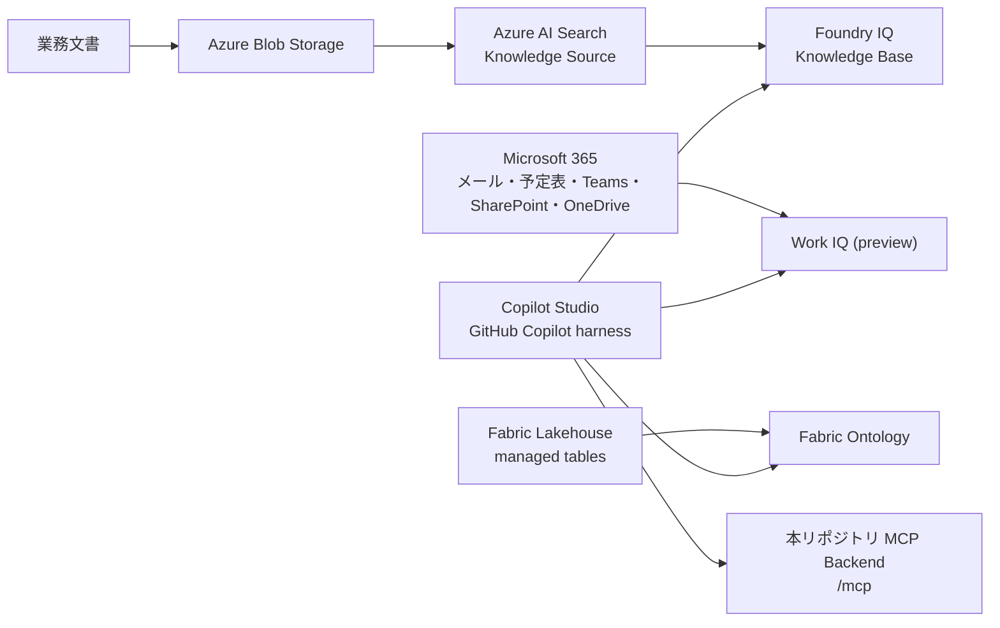

# 本番環境構築ガイド

このガイドは、Microsoft Copilot Studio の GitHub Copilot harness をオーケストレーション層として、Fabric IQ、Foundry IQ、Work IQ、および本リポジトリの MCP Backend を接続するための唯一の構築手順です。

**重要**: Fabric IQ、Foundry IQ、Work IQ のデータ取得は Copilot Studio の Tool が直接担当します。本リポジトリの IQ Adapter、`LiveAdapterSettings`、`WORK_IQ_*` / `FOUNDRY_IQ_*` / `FABRIC_IQ_*` 環境変数は、この構成では使用しません。

## 1. 構成と作業順



次の順序で実施します。

1. 課金、テナント、権限、リージョンを確認する
2. Fabric側でLakehouseとOntologyを構成する
3. Foundry/Azure AI Search側でKnowledge SourceとKnowledge Baseを構成する
4. Work IQ側でテナント、課金、ポリシー、テスト用Microsoft 365データを準備する
5. Copilot Studioで3つのIQ Toolと、本リポジトリのMCP Backendを接続する
6. 各Toolを単独検証し、最後に業務シナリオを検証する

## 2. 事前準備

### 2.1 必要な環境

- Microsoft Entra tenant
- Copilot Studio のGitHub Copilot harnessが利用可能な環境
- Microsoft Fabric workspaceとFabric対応capacity
- Azure subscription
- Azure AI Search service
- Azure Storage account(Foundry IQのBlob Knowledge Sourceを使う場合)
- Microsoft Foundry project(Azure AI SearchをKnowledgeとして接続する場合)
- Work IQを有効化できるGlobal Administrator
- Copilot Creditsの使用量ベース課金と、Work IQ用spending policy

製品のPreview、価格、リージョン、課金条件は変わるため、構築時点の公式情報を確認してください。

- [Copilot Studio harnesses](https://learn.microsoft.com/en-us/microsoft-copilot-studio/harnesses-overview)
- [Work IQのテナント有効化](https://learn.microsoft.com/en-us/microsoft-365/copilot/extensibility/work-iq/enable-work-iq)
- [Work IQ in Copilot Studio (preview)](https://learn.microsoft.com/en-us/microsoft-copilot-studio/add-work-iq)

### 2.2 リポジトリの準備

MCP BackendをAzureへデプロイする場合だけ、このリポジトリを取得して開発依存関係を検証します。

```bash
git clone <repository-url>
cd POC-Harness-CustomIQ
python3 -m venv .venv
source .venv/bin/activate
pip install -e ".[dev]"
ruff check .
pytest tests/
```

この手順はリポジトリのMCP Backendを検証するためのものです。Fabric、Foundry、Work IQの接続にPython Adapterを設定する手順ではありません。

### 2.3 オプション: 業界別サンプルデータ

サンプルデータを投入しなくても、空のSaaS環境とCopilot Studio接続の確認は実施できます。回答内容まで検証する場合は、各Industry Packの`sample-data/`を使用してください。すべて合成データであり、実在の個人、企業、患者、顧客、口座、住民、従業員の情報は含めません。

| 業界 | Fabric投入用CSV | Foundry用ナレッジ | Work IQ用M365テンプレート |
| --- | --- | --- | --- |
| Manufacturing | `industry-packs/manufacturing/sample-data/fabric/quality_issues.csv` | `industry-packs/manufacturing/knowledge/`（8文書） | `industry-packs/manufacturing/sample-data/work-iq/`（4記録） |
| Financial Services | `industry-packs/financial-services/sample-data/fabric/fraud_cases.csv` | `industry-packs/financial-services/knowledge/`（8文書） | `industry-packs/financial-services/sample-data/work-iq/`（4記録） |
| Retail | `industry-packs/retail/sample-data/fabric/inventory_records.csv` | `industry-packs/retail/knowledge/`（8文書） | `industry-packs/retail/sample-data/work-iq/`（4記録） |
| Healthcare | `industry-packs/healthcare/sample-data/fabric/encounters.csv` | `industry-packs/healthcare/knowledge/`（8文書） | `industry-packs/healthcare/sample-data/work-iq/`（4記録） |
| Public Sector | `industry-packs/public-sector/sample-data/fabric/cases.csv` | `industry-packs/public-sector/knowledge/`（8文書） | `industry-packs/public-sector/sample-data/work-iq/`（4記録） |

サンプルデータは業界ごとに分離して投入してください。複数業界を1つのKnowledge Baseへ混在させる場合は、Knowledge Source名、検索指示、引用元を業界単位で識別できるようにします。

### 2.4 エンタープライズ規模のサンプル

各Packには、既存generatorから再現可能なenterprise規模のCSVと、業界5シナリオ×10件、合計50件のpromptライブラリを用意しています。

| 業界 | Enterprise CSV | Foundry JSONL | Promptライブラリ | レコード規模の目安 |
| --- | --- | --- | --- | --- |
| Manufacturing | `sample-data/fabric/enterprise/` | `sample-data/foundry/enterprise/records.jsonl` | `sample-data/prompts/enterprise_prompts.yaml` | 約23,000行 |
| Financial Services | `sample-data/fabric/enterprise/` | `sample-data/foundry/enterprise/records.jsonl` | `sample-data/prompts/enterprise_prompts.yaml` | 約65,000行 |
| Retail | `sample-data/fabric/enterprise/` | `sample-data/foundry/enterprise/records.jsonl` | `sample-data/prompts/enterprise_prompts.yaml` | 約160,000行 |
| Healthcare | `sample-data/fabric/enterprise/` | `sample-data/foundry/enterprise/records.jsonl` | `sample-data/prompts/enterprise_prompts.yaml` | 約85,000行 |
| Public Sector | `sample-data/fabric/enterprise/` | `sample-data/foundry/enterprise/records.jsonl` | `sample-data/prompts/enterprise_prompts.yaml` | 約47,000行 |

CSVを再生成する場合:

```bash
python3 scripts/generate_enterprise_sample_data.py
```

promptを再生成する場合:

```bash
python3 scripts/generate_enterprise_prompts.py
```

両スクリプトは固定seedを使用するため、同じ入力から同じ合成データを再生成できます。CSVは全テーブルをFabric Lakehouseへ取り込み、Ontologyのentity typeごとに対応テーブルをバインドしてください。JSONLはBlob Knowledge Sourceのcontainerへアップロードし、`id`をキー、`content`を検索対象フィールドとしてインデックス化してください。promptはFoundry IQの評価質問、Copilot StudioのPreviewテスト、Work IQの質問テンプレートとして利用できます。

## 3. Fabric IQ側の構成

### 3.1 Fabric tenantとworkspace

1. Fabric管理者として管理ポータルを開く。
2. **Enable Ontology item (preview)** を有効化する。
3. Fabric対応capacityにworkspaceを作成する。
4. 構築担当者へworkspaceの作成・編集権限を付与する。

参照: [Ontology required tenant settings](https://learn.microsoft.com/en-us/fabric/iq/ontology/overview-tenant-settings)

### 3.2 Lakehouseと業務データ

実顧客データから業務概念、entity key、relationship、curated tableを設計する場合は、先に[実顧客データ向けOntology設計・構築ガイド](Customer-Data-Ontology-Design-Guide.md)を完了する。生成AIによる候補抽出を利用する場合も、Data owner、Data steward、Security/Privacyによる承認前に本番Ontologyへ反映しない。

1. Workspaceで **New item > Lakehouse** を作成する。
2. このリポジトリのIndustry Packデータ、または検証用の合成データをLakehouseへ投入する。
3. `Files`へ置いたデータを、Ontologyで利用できるmanaged Lakehouse tableへ変換する。
4. テーブルのキー列、業務プロパティ列、時系列列を確認する。
5. OneLake security、column mapping、external tableの利用可否をOntologyの制約に照らして確認する。

**オプションのサンプル投入**:

1. 対象Industry Packの`sample-data/fabric/enterprise/*.csv`をローカルからFabric Lakehouseの`Files`へアップロードする。短時間の接続確認だけなら、同階層の小容量CSVを使用する。
2. CSVをLakehouse tableとして読み込む。テーブル名はCSVの業務名に合わせる(例: `quality_issues`, `fraud_cases`, `encounters`, `cases`, `inventory_records`)。
3. Ontologyで使うentity type keyとCSV列の型を確認する。
4. 業界Packの`ontology/entities.yaml`と同じentity typeを作成し、CSV列をpropertyへマッピングする。
5. 追加のentity typeやrelationshipを作成する場合は、既存のgeneratorやOntology定義を参照して同じ合成ID体系を維持する。

参照:

- [Create a lakehouse](https://learn.microsoft.com/en-us/fabric/data-engineering/create-lakehouse)
- [Load data into a lakehouse](https://learn.microsoft.com/en-us/fabric/data-engineering/load-data-lakehouse)
- [Ontology data binding limitations](https://learn.microsoft.com/en-us/fabric/iq/ontology/how-to-bind-data#limitations-and-troubleshooting)

### 3.3 具体例: ManufacturingサンプルをLakehouseへ登録する

以下はManufacturing Packを最初に構築する場合の入力例です。`<workspace-name>`と実際の容量は組織の命名規則に置き換えてください。

1. Fabric workspaceを`iiq-manufacturing-dev`として作成し、対象のFabric capacityへ割り当てる。
2. **New item > Lakehouse**でLakehouse名に`IIQManufacturingLH`を入力して作成する。
3. `industry-packs/manufacturing/sample-data/fabric/enterprise/`配下のCSVを`Files/enterprise/`へアップロードする。
4. 各CSVをmanaged tableとして読み込み、次のテーブル名を使う。

| CSVファイル | Lakehouse table名 | 行数目安 | 主キー |
| --- | --- | --- | --- |
| `factories.csv` | `factories` | 40 | `factory_id` |
| `production_lines.csv` | `production_lines` | 320 | `line_id` |
| `suppliers.csv` | `suppliers` | 1,000 | `supplier_id` |
| `parts.csv` | `parts` | 5,000 | `part_id` |
| `quality_issues.csv` | `quality_issues` | 12,000 | `issue_id` |
| `engineering_changes.csv` | `engineering_changes` | 5,000 | `change_id` |

1. 最低限、`quality_issues`の読み込み結果が12,000行であること、`issue_id`が重複していないことを確認する。最初の行は`QI-00001`で、`part_id`は`PART-04011`、`factory_id`は`FAC-010`である。
2. Ontology data bindingの前に、全テーブルが**managed** tableであり、OneLake securityとDelta column mappingが有効ではないことを確認する。

### 3.4 具体例: Manufacturing Ontologyを作成する

1. **New item > Ontology (preview)**を選択し、Nameに`IIQManufacturingOntology`を入力して**Create**を選択する。名前には空白・ハイフンを使わない。
2. **Build directly from OneLake**を選択する。
3. 次のentity typeを作成し、各行の**Bind data > Add data binding > Lakehouse table**で`IIQManufacturingLH`と対応tableを選択する。

| Entity type | Source table | Entity type key | Display name property | 追加するproperty |
| --- | --- | --- | --- | --- |
| `Factory` | `factories` | `factory_id` | `name` | `factory_id`, `name`, `location` |
| `ProductionLine` | `production_lines` | `line_id` | `name` | `line_id`, `factory_id`, `name` |
| `Supplier` | `suppliers` | `supplier_id` | `name` | `supplier_id`, `name`, `region`, `reliability_score` |
| `Part` | `parts` | `part_id` | `name` | `part_id`, `name`, `supplier_id`, `used_in_line_ids` |
| `QualityIssue` | `quality_issues` | `issue_id` | `summary` | `issue_id`, `part_id`, `factory_id`, `summary`, `severity`, `status`, `defect_rate_percent`, `detected_at` |
| `EngineeringChange` | `engineering_changes` | `change_id` | `description` | `change_id`, `issue_id`, `description`, `status`, `created_at` |

1. 各entity typeで**Define entity type key**を選択し、表の主キーpropertyを選択して**Save**する。文字列型のIDを使用する。
2. 次のrelationshipを作成する。Relationshipを選択後、**Mapping table**と両側の**Matched**列を表の通り設定して**Save**する。

| Relationship name | Origin entity | Target entity | Mapping table | Matched origin | Matched target |
| --- | --- | --- | --- | --- | --- |
| `produces` | `Factory` | `ProductionLine` | `production_lines` | `factory_id` | `line_id` |
| `supplies` | `Supplier` | `Part` | `parts` | `supplier_id` | `part_id` |
| `affects` | `QualityIssue` | `Part` | `quality_issues` | `issue_id` | `part_id` |
| `observedAt` | `QualityIssue` | `Factory` | `quality_issues` | `issue_id` | `factory_id` |
| `addresses` | `EngineeringChange` | `QualityIssue` | `engineering_changes` | `change_id` | `issue_id` |

`Part.used_in_line_ids`はJSON配列であり、relationship bindingが要求する単一のMatched列ではありません。このサンプルでは`usedIn` relationshipを作成しません。必要な場合は、`part_id`と`line_id`を1行ずつ持つmanaged junction table(例: `part_production_lines`)を別途作成してからbindingします。

1. `QualityIssue`の**Instances**で`QI-00001`を検索し、`PART-04011`、`FAC-010`、`medium`、`resolved`が表示されることを確認する。Overview/Graphでは`affects`と`observedAt`のrelationshipを確認する。

### 3.5 Ontology item、entity type、property、relationship

1. Workspaceで **New item > Ontology (preview)** を作成する。
2. OneLakeから直接構築するか、既存のPower BI semantic modelから生成するかを選択する。
3. Home configuration canvasで **Add entity type** を選択し、業務概念名を登録する。
4. **View entity type details > Configure > Manage property bindings > Add properties** でプロパティを登録する。
5. entity type keyとdisplay name propertyを決める。
6. **Bind data** でLakehouse tableを選択し、キー、プロパティ、必要な時系列列をマッピングする。
7. entity type間の関係を作成し、origin、target、mapping table、双方のkey mappingを設定する。
8. 保存後、entity type detailsの **Instances** と **Overview/Graph** でデータと関係を確認する。
9. 上流テーブルを更新した場合は、Ontologyに関連するGraph modelを手動更新する。

参照:

- [Create an Ontology](https://learn.microsoft.com/en-us/fabric/iq/ontology/tutorial-1-create-ontology)
- [Create entity types](https://learn.microsoft.com/en-us/fabric/iq/ontology/how-to-create-entity-types)
- [Bind data](https://learn.microsoft.com/en-us/fabric/iq/ontology/how-to-bind-data)
- [View entity type details and refresh](https://learn.microsoft.com/en-us/fabric/iq/ontology/how-to-view-entity-type-details)

### 3.6 Copilot Studio接続に必要な値

Ontology itemのURLから次の2つを控えます。

- Fabric workspace ID
- Ontology item ID

Copilot StudioでOntology MCP Toolを追加する際に使用します。FabricのOntology MCP endpointを汎用MCP URLとして手入力するのではなく、Copilot Studioの専用 **Fabric IQ MCP (Preview)** Toolを使用します。

## 4. Foundry IQ側の構成

### 4.1 Azure AI SearchとFoundry

1. Agentic retrieval対応のAzure AI Search serviceを作成する。
2. Microsoft Foundry projectを作成または選択する。
3. Foundryの **Build > Knowledge** からAzure AI Searchを接続する。
4. Search service、Foundry project、Storage、モデルのmanaged identity/RBACを設定する。
5. Knowledge SourceとKnowledge Baseを作成できるContributor/Data Plane権限を構築担当者に付与する。
6. answer synthesisやquery planningを使う場合は、必要なモデルdeploymentとCognitive Services権限を設定する。

参照:

- [What is Foundry IQ](https://learn.microsoft.com/en-us/azure/foundry/agents/concepts/what-is-foundry-iq)
- [Create a Knowledge Base](https://learn.microsoft.com/en-us/azure/search/agentic-retrieval-how-to-create-knowledge-base)
- [Azure AI Search agentic knowledge sources](https://learn.microsoft.com/en-us/azure/search/agentic-knowledge-source-overview)
- [Copilot Studio and Azure lab](https://github.com/Azure/Copilot-Studio-and-Azure)

### 4.2 Knowledge Sourceへのナレッジ登録

Blob Knowledge Sourceを使う場合:

1. Storage accountとcontainerを作成する。
2. 業務文書、手順書、規程、Industry Packのナレッジ文書をアップロードする。
3. Search service managed identityへ **Storage Blob Data Reader** を付与する。
4. Foundryの **Build > Knowledge** またはAzure AI Search APIからBlob Knowledge Sourceを作成する。
5. チャンク化、embedding、chat completionに使用するモデルdeploymentを指定する。
6. Knowledge Sourceの取り込み状態を確認し、失敗件数が0になるまで修正する。
7. 生成されたdata source、skillset、index、indexerを確認する。

**オプションの業界別ナレッジ投入**:

1. 対象Industry Packの`knowledge/`配下にあるMarkdown文書をBlob containerへコピーする。
2. Blob Knowledge Sourceのcontainerを業界単位に分けるか、Blob metadata/ディレクトリで業界を識別する。
3. Knowledge Source名に業界を含める(例: `ks-manufacturing`, `ks-financial-services`)。
4. 取り込み完了後、各文書に固有の質問を実行し、引用元が正しい業界文書であることを確認する。

このリポジトリのKnowledge文書はFoundry IQ用の合成ナレッジとしてそのまま使えます。Markdown以外の形式へ変換する場合も、内容、業界名、文書ID、合成データであることを保持してください。

promptライブラリの利用例:

1. `sample-data/prompts/enterprise_prompts.yaml`を読み込む。
2. `scenario`ごとに質問を分け、Foundry IQの引用品質、Fabric IQのOntology検索、Work IQの権限境界、MCP Backendの業界Tool応答を個別に評価する。
3. 同じpromptを複数回実行する場合は、回答、引用、Activity trace、Tool選択を保存して比較する。

Blob以外にAzure SQL、OneLake、SharePoint、Fabric Data Agent、Fabric Ontology、Work IQなどのKnowledge Sourceを追加する場合も、先に各接続先の認証・権限を完成させてからKnowledge Baseへ追加します。

参照: [Create a Blob Knowledge Source](https://learn.microsoft.com/en-us/azure/search/agentic-knowledge-source-how-to-blob)

### 4.3 具体例: Manufacturing Knowledge Sourceを作成する

以下は、最初の検証用に公開ネットワーク接続とKeyless authenticationを使う例です。Private network、ユーザー単位の文書権限、画像処理が必要な場合は、公式ドキュメントの追加要件を先に満たしてください。

1. 次の名前をこの例の設定値として使用する。Azure resource名は組織内で一意になるよう、`<unique-suffix>`を実値に置換する。

| 設定項目 | 設定値の例 |
| --- | --- |
| Resource group | `rg-iiq-manufacturing-dev` |
| Storage account | `stiiqmanufacturing<unique-suffix>` |
| Blob container | `manufacturing-knowledge` |
| Azure AI Search service | `srch-iiq-manufacturing-<unique-suffix>` |
| Foundry project | `iiq-manufacturing-project` |
| Knowledge Source name | `ks-manufacturing-policy` |
| Knowledge Base name | `kb-manufacturing-operations` |
| Content extraction mode | `minimal` |
| Network access mode | `public` |

1. Blob container `manufacturing-knowledge`へ`industry-packs/manufacturing/knowledge/`配下の8ファイルをアップロードする。最小接続確認だけを行う場合は、最初に次の3ファイルを投入し、疎通確認後に残り5ファイルを追加する。

    - `industry-packs/manufacturing/knowledge/quality_control_procedure.md`
    - `industry-packs/manufacturing/knowledge/supplier_quality_manual.md`
    - `industry-packs/manufacturing/knowledge/engineering_change_process.md`

2. Azure AI Search serviceのsystem-assigned managed identityを有効化し、Storage accountスコープで**Storage Blob Data Reader**、Foundryモデルresourceスコープで**Cognitive Services User**を付与する。作成者には**Search Service Contributor**と**Search Index Data Contributor**を付与する。
3. Foundryの**Build > Knowledge**で**Create knowledge source**を選択し、次を入力する。

| 画面項目 | 設定値 |
| --- | --- |
| Name | `ks-manufacturing-policy` |
| Description | `Synthetic manufacturing quality, supplier, and engineering procedures.` |
| Source type | `Azure Blob Storage` |
| Container | `manufacturing-knowledge` |
| Folder path | 空欄 |
| Content extraction mode | `minimal` |
| Image verbalization | 無効 |
| Network access mode | `public` |
| Embedding model | `<your-embedding-deployment>` |
| Chat completion model | `<your-chat-deployment>` |

`<your-embedding-deployment>`と`<your-chat-deployment>`は、同じFoundry resource上で事前にデプロイしたモデルの**deployment name**を入力する。モデル名を推測で固定しないでください。2026-08-01-preview APIを用いる場合、公式ドキュメントには`text-embedding-3-large`と`gpt-5-mini`の例がありますが、リージョンと利用可否を確認してから実際のdeploymentを選択します。

1. 作成後、Knowledge Source statusで`lastSynchronizationState.endTime`が設定され、`itemsUpdatesFailed`が`0`であることを確認する。自動生成されたdata source、skillset、indexer、indexは直接編集しない。

enterprise JSONL(`sample-data/foundry/enterprise/records.jsonl`)は構造化業務レコードの検索検証用に生成した補助データであり、上記8件の管理文書とは用途が異なります。Blob Knowledge Sourceへ投入する前に、利用するAPI versionとBlob indexerがJSONLを対応コンテンツ形式として扱うことを実環境で確認してください。未確認のまま投入形式を断定しないため、最初の構築はMarkdown文書で開始します。

### 4.4 具体例: Manufacturing Knowledge Baseを作成して検証する

1. **Build > Knowledge > Create knowledge base**を選択する。
2. Nameに`kb-manufacturing-operations`、Descriptionに`Synthetic knowledge base for manufacturing quality, supplier, and engineering-change procedures.`を入力する。
3. Knowledge Sourceに`ks-manufacturing-policy`を追加する。
4. LLMを使用するPreview構成では、Modelsに`<your-chat-deployment>`を選択し、Output modeに`answerSynthesis`、Retrieval reasoning effortに`auto`を設定する。
5. Retrieval instructionsに`Use ks-manufacturing-policy for questions about quality procedures, supplier quality, and engineering changes. Cite the source document used.`を入力する。
6. Answer instructionsに`Answer in Japanese. Separate confirmed facts from recommendations. Do not approve engineering changes or close quality issues.`を入力する。
7. Retrieve defaultsを設定できる場合は、`maxRuntimeInSeconds`を`45`、`maxOutputDocuments`を`8`、`maxOutputSizeInTokens`を`12000`に設定する。これは公式ドキュメントの設定例であり、組織の応答時間とコスト要件に応じて見直す。
8. Knowledge Baseを保存し、Foundry側のPlaygroundまたはRetrieveで`What does the supplier quality manual require before escalating a quality issue?`を実行する。回答にアップロード済みのMarkdown文書への引用が含まれることを確認する。
9. ここで作成した`kb-manufacturing-operations`を、後続のCopilot Studio接続で選択する。Copilot Studio側でKnowledge Baseを作り直さない。

## 5. Work IQとMicrosoft 365側の構成

### 5.1 Work IQのテナント有効化

1. Copilot StudioでAzure subscriptionとresource groupを割り当てた使用量ベース課金を設定する。
2. Global Administratorで次を実行するか、Graph Explorerから同等のservice principal作成を行う。

```bash
az ad sp create --id fdcc1f02-fc51-4226-8753-f668596af7f7
```

1. Microsoft 365 admin centerのWork IQ MCP設定が利用可能になることを確認する。
2. Work IQ用のspending policyを作成する。
3. Work IQ MCP policyを確認する。読み取り専用を初期値とし、書き込み操作は明示的な承認がある場合だけ有効化する。

参照:

- [Enable your tenant for Work IQ](https://learn.microsoft.com/en-us/microsoft-365/copilot/extensibility/work-iq/enable-work-iq)
- [Work IQ MCP policy governance](https://learn.microsoft.com/en-us/microsoft-365/copilot/extensibility/work-iq/mcp/policy-governance-mcp)

### 5.2 Microsoft 365データの準備

Work IQへデータをアップロードしたり、別の検索インデックスへ手動登録したりする作業はありません。Work IQはユーザーの既存Microsoft 365データを、ユーザー権限とテナントポリシーの範囲で参照します。

1. テストユーザーを用意する。
2. Exchange Onlineのメール・予定表、Teams、SharePoint、OneDriveに検証用の非機密データを作成する。
3. テストユーザーがそのデータを通常のMicrosoft 365権限で参照できることを確認する。
4. 読み取りテスト用の質問を決める(例: 最近の会議、プロジェクトに関する最近のTeams会話、指定文書の要約)。
5. 書き込みテストを行う場合は、送信・作成・更新・アクションを許可するテナントポリシーとテスト対象を別途レビューする。

**オプションの業界別M365サンプル投入**:

1. 対象Industry Packの`sample-data/work-iq/`からMarkdownテンプレートを選ぶ。
2. 専用のテストSharePointライブラリへアップロードするか、専用のテストTeamsチャンネルへ内容を投稿する。メール・予定表を検証する場合は、テストユーザー間で合成内容のメールまたは会議を作成する。
3. 小容量CSVを使用する場合は、テンプレートに書かれた合成ID（`QI-SYN-*`、`CASE-SYN-*`等）を変更せず、Fabric側の同じIDと関連付ける。enterprise CSVを使用する場合はID体系が異なるため（Manufacturingの例: `QI-00001`）、投入済みレコードを1件選び、同一案件を参照するすべてのWork IQテンプレート内のIDをそのレコードのIDへ一貫して置換する。小容量とenterpriseのIDを混在させない。
4. Copilot StudioのWork IQ Toolから、最近の会話、会議、文書の要約を質問する。
5. テスト終了後は、作成したテスト文書、Teams投稿、メール、会議を削除し、残存データと保持ポリシーを確認する。

Work IQへファイルをAPIでアップロードする手順ではありません。Microsoft 365サービス側にテストコンテンツを作成し、Work IQがユーザー権限の範囲でそれを参照できることを確認する手順です。

Work IQ側の完了条件は「Work IQにファイルを登録した」ではなく、テストユーザーがCopilot Studioから自分の権限範囲のM365コンテキストを取得できることです。

## 6. Copilot Studioで接続する

### 6.1 エージェント

1. Copilot StudioでGitHub Copilot harnessのエージェントを作成または選択する。
2. 対象業界に対応する次のファイル本文を、エージェントのInstructionsへ設定する。複数業界を1エージェントへ混在させず、業界ごとにエージェント、接続、評価結果を分離する。

| 業界 | Copilot Studio用指示文 |
| --- | --- |
| Manufacturing | `industry-packs/manufacturing/agents/investigation_agent_instructions.md` |
| Financial Services | `industry-packs/financial-services/agents/investigation_agent_instructions.md` |
| Retail | `industry-packs/retail/agents/investigation_agent_instructions.md` |
| Healthcare | `industry-packs/healthcare/agents/investigation_agent_instructions.md` |
| Public Sector | `industry-packs/public-sector/agents/investigation_agent_instructions.md` |

1. Instructionsに記載されたFabric IQ、Foundry IQ、Work IQ、MCP Backendを後続手順で追加する。接続していないTool名をInstructionsから削除せず、公開前に接続を完了するか、そのToolを利用できないことを回答する運用を確認する。
2. Preview画面で、正常取得、0件、権限不足、Tool失敗、情報源矛盾、禁止操作要求をテストする。
3. 回答が確認済み事実、推奨、不足情報、人手承認、参照元を分離し、サンプル利用時だけ合成データと表示することを確認する。

### 6.2 Fabric IQ MCP

1. **Tools > Add Tool > Fabric IQ MCP (Preview)** を選択する。
2. **Create new connection** を選択し、Microsoft Entra IDで接続する。
3. Fabric workspace IDとOntology item IDを入力する。
4. **Create**、続けて**Add**を選択する。
5. ToolにOntology entity typeの一覧・検索ツールが表示されることを確認する。
6. Ontologyに登録した業務概念を使う質問を実行し、MCP同意とActivity traceを確認する。

参照: [Create an Ontology Agent with Copilot Studio](https://learn.microsoft.com/en-us/fabric/iq/ontology/how-to-create-agent-copilot-studio)

### 6.3 Foundry IQ

1. **Tools > Add Tool > Foundry IQ** を選択する。
2. Copilot Studioの接続画面で認証方式を選択する。
3. 4.3で作成・検証したKnowledge Baseを選択する。
4. **Add to agent**、保存する。
5. Knowledge Baseの文書に関する質問を実行する。
6. Activity traceでFoundry IQが呼び出され、引用が返ることを確認する。

Foundry IQのKnowledge Source、Indexer、Knowledge Base、モデル、RBACは4章で先に構成します。Copilot StudioはKnowledge Baseを消去・再作成する場所ではありません。

参照: [Copilot Studio and Azure repository](https://github.com/Azure/Copilot-Studio-and-Azure)

### 6.4 Work IQ (preview)

1. **Tools > Add Tool > Model Context Protocol** を選択する。
2. **Work IQ (preview)** を選択する。
3. 接続ドロップダウンから **Create New Connection**、**Create**を選択する。
4. テストユーザーでサインインする。
5. **Add and Configure**を選択する。
6. M365コンテキストを必要とする質問を実行する。
7. 接続許可を求められた場合は**Allow**を選択する。
8. 応答とActivity traceを確認する。

Work IQ (preview)はGitHub Copilot harnessで動作し、Copilot Creditsの使用量ベース課金を使用します。これは汎用Remote MCP URLを手入力する手順ではありません。

参照: [Work IQ in Copilot Studio](https://learn.microsoft.com/en-us/microsoft-copilot-studio/add-work-iq)

### 6.5 本リポジトリのMCP Backend

IQのデータ取得は上記のCopilot Studio Toolが担当します。本リポジトリのMCP Backendは、Foundry IQ、Fabric IQ、Work IQに存在しない顧客固有Business Systemを、Copilot Studioから呼び出せる業務Toolとして公開するための共通層です。IQのKnowledge SourceやOntologyを代替・再実装するものではありません。

現在の実装は、各Industry Packの`tools/*.py`を共通のMCPプロトコルで公開し、起動時に渡されたdatasetへ問い合わせます。したがって、**業界別のTool実装と合成サンプルdatasetは実装済み**ですが、顧客Business Systemへの実接続アダプターは未実装です。顧客環境では、同じTool契約を維持したまま、datasetの取得元をERP、CRM、MES、ケース管理、在庫管理などの実システムへ置き換えます。

業界別のサンプルToolは次のPackに含まれています。

| 業界 | サンプルTool実装 | 主なサンプルdataset |
| --- | --- | --- |
| Manufacturing | `industry-packs/manufacturing/tools/manufacturing_tools.py` | Factory、ProductionLine、Supplier、Part、QualityIssue、EngineeringChange |
| Financial Services | `industry-packs/financial-services/tools/financial_services_tools.py` | Customer、Account、Transaction、FraudCase |
| Retail | `industry-packs/retail/tools/retail_tools.py` | Store、Product、InventoryRecord、Order、DemandSignal |
| Healthcare | `industry-packs/healthcare/tools/healthcare_tools.py` | SyntheticPatient、Provider、Encounter、ClinicalEvent |
| Public Sector | `industry-packs/public-sector/tools/public_sector_tools.py` | SyntheticCitizen、Agency、Case、Application |

顧客固有Business Systemを接続する場合の責務は、次の通りです。

1. 顧客側API/DBからdatasetを取得する実装を追加する。
2. 認証、Secret管理、ネットワーク、レート制限、監査ログを顧客環境に合わせて構成する。
3. Industry PackのTool入力・出力契約を維持する。
4. Copilot StudioからMCP Backendを呼び出し、`tools/list`と`tools/call`を検証する。

現時点の`run_dev_server.py`は、5業界のうちManufacturingの合成datasetを使って共通Backendを起動する開発用サンプルです。これは顧客Business Systemへの接続完了を意味しません。

Tool契約とendpointの詳細は[MCP Backendドキュメント](mcp/README.md)、公開前の実装済み対策と未実装項目は[MCPセキュリティガイド](mcp/MCP-Security-Guide.md)を参照する。

1. [Custom MCP Backendラボ](labs/advanced-mcp.md)に従い、`azd provision --preview`で作成対象を確認する。
2. `azd up`でsourceからimageをbuildし、ACRへpushして内部IngressのContainer Appへdeployする。
3. Container内から`/health`を検証し、Ingressの`external`が`false`であることを確認する。
4. 受信request認証とCopilot Studioから到達可能なnetwork経路を設計・実装する。
5. Security承認後に限り、Copilot Studioの**Tools > Add Tool > Model Context Protocol**へHTTPSの`/mcp` endpointを追加する。
6. `initialize`、`tools/list`、`tools/call`と、認証拒否、allowlist、エラー応答を検証する。

現在のBicepは意図的に内部Ingressを使用します。MCP Backendには受信request認証が実装されていないため、手順4が完了するまでCopilot Studioとの外部接続は**未実装**です。単に`external: true`へ変更して完了扱いにしません。

## 7. 最終検証

| 検証対象 | 合格条件 |
| --- | --- |
| Fabric IQ | OntologyのInstances/Graphが表示され、Copilot Studioから業務概念で回答できる |
| Foundry IQ | Knowledge Baseの回答に登録文書の引用が含まれる |
| Work IQ | テストユーザーがアクセス可能なメール・予定表・Teamsデータだけが返る |
| MCP Backend | Copilot Studioが`initialize`、`tools/list`、`tools/call`を完了する |
| 権限境界 | 別ユーザーの未許可データや、許可していない書き込み操作が実行されない |

小容量サンプルの生成と各SaaSへの反映は[IQデモデータ投入・再構成ランブック](evaluation/Demo-Data-Deployment-Runbook.md)、業界別の単一レイヤー疎通、複合質問、性能測定は[Copilot Studio IQレイヤー別テスト質問集](evaluation/Copilot-Studio-IQ-Layer-Test-Catalog.md)に従って実施する。

0件、NL query変換失敗、権限不足、Tool接続失敗の切り分けは[トラブルシューティング](troubleshooting/README.md)を参照する。

## 8. このリポジトリの責務

本リポジトリが提供するものは、Industry PackのMCPツール、MCP Backend、Azureデプロイ定義、契約・セキュリティ検証です。Fabric IQ、Foundry IQ、Work IQのSaaS構成とデータアクセスは各SaaS管理画面およびCopilot Studioで行います。IQ用AdapterやローカルOrchestratorはこの本番構成には存在しません。
