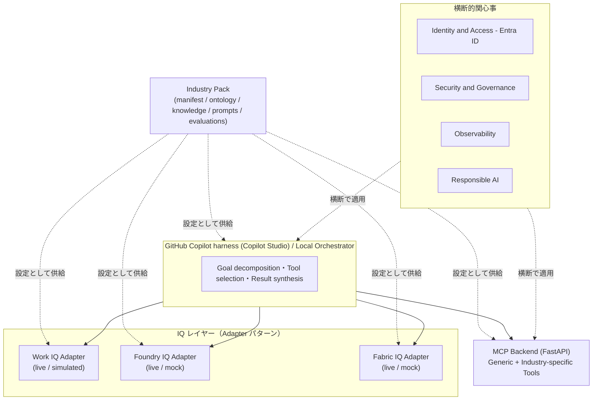

# アーキテクチャガイド(Phase 6 版)

> このガイドは Phase 6(30分セルフガイドデモドキュメント、評価エンジン実装済み)時点の内容です。実際の Microsoft 製品 API 仕様が検証され次第更新します。

## 1. 目的

このリポジトリは、複数業界（Manufacturing / Financial Services / Retail / Healthcare / Public Sector）へ、**Industry Pack の差し替えだけで**展開できる Enterprise Intelligence Platform アクセラレータです。業界切り替え時にプラットフォームのコードを変更しないことが最重要の設計原則です。

## 2. レイヤー構成

### 2.1 GitHub Copilot harness / Local Orchestrator

複雑なタスクの計画・ツール選択・結果統合を担う Agent Runtime。単純な FAQ やルールベース処理には、Standard harness や通常の Workflow の方が適切な場合があり、その選択理由は本ガイドの改訂時に追記します（Phase 2 以降）。

### 2.2 Work IQ / Foundry IQ / Fabric IQ

instruction §5.2〜5.4 の定義に従う Work Context / Knowledge / Semantic レイヤー。すべて `iq_platform.contracts.adapter.Adapter` を実装する Adapter として提供されます。

### 2.3 MCP Backend

外部システム・業務データ・業務アクションを標準化された Tool として公開する Integration and Action Layer。FastAPI で実装します（Phase 2）。

### 2.4 横断的関心事

Identity and Access、Security and Governance、Observability、Responsible AI は、特定の IQ レイヤーに属さない独立した横断レイヤーとして設計します（instruction §5.6）。

## 3. Adapter パターンと mode

すべての Adapter は次のインターフェース（`iq_platform.contracts.adapter.Adapter`、ABC）を実装します。

- `health_check()`
- `capabilities()`
- `mode`（プロパティ）
- `query(operation, parameters)`
- `validate_configuration()`
- `get_diagnostics()`

`mode` は次の5値のいずれかです（`iq_platform.contracts.capability.AdapterMode`）。

- `live`
- `mock`
- `simulated`
- `unavailable`
- `verification_required`

Adapter は認証エラー等で Live に接続できない場合、無言で Mock へフォールバックしません。呼び出し側が `health_check()` / `get_diagnostics()` で理由を確認できるようにします。

## 4. Capability Registry

`config/capabilities.yaml` が Microsoft 製品状態に関する唯一の真実の情報源です（[ADR-0007](../decisions/0007-capability-registry-authority.md)）。`status` が GA / Preview / Private Preview の場合、`last_verified_date` と非 TBD の `documentation_reference` が必須であることをスキーマレベルで強制しています（`iq_platform.contracts.capability.Capability` の validator）。

## 5. Industry Pack Contract

各 Industry Pack は `manifest.yaml` を持ち、`iq_platform.contracts.manifest.IndustryPackManifest` で検証されます([ADR-0004](../decisions/0004-industry-pack-manifest-schema.md)、[ADR-0011](../decisions/0011-generic-orchestrator-and-semantic-adapter.md))。Phase 3 終了時点で5業界すべて(Manufacturing / Financial Services / Retail / Healthcare / Public Sector)が同一スキーマで実装されています。

## 6. Agent Response Contract

すべてのエージェントの最終回答は `iq_platform.contracts.agent_response.AgentResponse`（14項目）を経由します（[ADR-0005](../decisions/0005-agent-response-contract.md)）。`mock_or_simulation_disclosure` と `responsible_ai_notice` は必須フィールドで、省略した回答は構築できません。

## 7. 実行モード

- **Local Preview Mode**: 全 IQ レイヤーをローカルの Mock/Simulated Adapter で模擬。Microsoft SaaS サービスの動作検証ではありません。
- **Hybrid Mode**: 一部のサービスのみ実環境（テスト用 Azure サブスクリプション、[assumptions.md](../decisions/assumptions.md) A8）に接続。
- **Full SaaS Mode**: 利用可能なサービスを実環境に接続。利用可能性は必ず Capability Registry と Health Check で判定します。

## 8. 現在の実装状況（Phase 4 終了時点）

実装済み:
- `iq_platform/contracts/`（Adapter, Manifest, MCPToolResponse, AgentResponse, Capability の Pydantic モデル。`semantic_relationships_path`/`scenario_module_path` を含む）
- `iq_platform/capability_registry/`（`config/capabilities.yaml` のローダー・検証）
- `iq_platform/orchestration/`（Industry Pack ローダー、`GenericLocalOrchestrator` - 業界非依存）
- `iq_platform/adapters/`（Mock/Simulated 3種 + Live Adapter 3種。Live は verification_required スキャフォールド、[ADR-0013](../decisions/0013-live-adapter-verification-required-scaffold.md)）
- `iq_platform/configuration/settings.py`（`LiveAdapterSettings` - Live Adapter 用環境変数の読み込み・検証）
- `iq_platform/security/entra_auth.py`（`azure-identity` による実 Microsoft Entra ID 認証）
- `iq_platform/observability/logging_config.py`（correlation_id 付き最小限のロギング）
- `services/mcp-backend/`（FastAPI アプリ、汎用 `ToolRegistry`、`build_app()` は任意の Industry Pack の `mcp_tools_path` を読み込む。`server.py` は環境変数駆動の本番エントリポイント）
- `apps/demo-cli/`（`setup` / `health`（Live Adapter 状態表示含む）/ `validate` / `load-data` / `select-industry` / `run-demo` / `evaluate` / `generate-summary` / `reset` / `cleanup` の全10コマンドを実装。`health` 以下8コマンドは5業界すべてに対応。`cleanup` は実 azd 環境が存在しない場合は安全に中断する)
- `services/mcp-backend/mcp_backend/registry.py`（`MCP_BACKEND_ALLOWED_TOOLS` 環境変数によるツール許可リスト機能。未許可の Tool 名は構造化エラーで拒否）
- `industry-packs/{manufacturing,financial-services,retail,healthcare,public-sector}/`（各業界の manifest、ontology、synthetic data generator、knowledge documents、work-context fixtures、MCP tools、semantics plugin、scenario plugin、prompts、expected-results、evaluations、terminology、responsible-ai）
- `deployment/`（azd/Bicep/コンテナ、MCP Backend の Azure Container Apps デプロイ基盤、[ADR-0012](../decisions/0012-mcp-backend-deployment-target.md)）
- `scripts/security/scan_secrets.py`、`scripts/cleanup/cleanup-azure.sh`
- `docs/setup/live-adapters-configuration.md`（Entra ID アプリ登録手順は実施可能、製品固有部分は TBD）
- `tests/contract/test_all_industry_packs_manifest_schema.py`（5業界すべての manifest 検証、パス存在確認、ガードレール有無確認）
- `tests/end-to-end/test_industry_pack_switching.py`（5業界すべての代表シナリオ実行、Industry Pack 切り替え時の状態非漏洩確認、禁止アクション文言の非混入確認）
- `tests/unit/test_live_adapters.py`（Live Adapter の mode 遷移、Entra ID 認証成功/失敗時の挙動、`query()` が常に例外を送出することを検証。実ネットワーク呼び出しなし）
- `docs/architecture/sample-outputs/`（実際に実行して得た Manufacturing の `AgentResponse` の実例）

未実装（今後のフェーズ、または本番環境がないと検証不能な項目）:
- Live Adapter の実 API 統合（`query()` の実装。Microsoft 製品仕様が検証でき次第、Phase 4 を再開）
- 実 Azure サブスクリプションへの `azd up` デプロイ検証（実行手順は [docs/deployment/Step-by-Step-Deployment-Guide.md](../deployment/Step-by-Step-Deployment-Guide.md) に記載済みだが、実サブスクリプションでの実行自体は未実施）
- 実 Entra ID テナントに対する認証検証（コード・単体テストは実装済み、実テナントでの検証待ち）
- Terraform 実装（[ADR-0008](../decisions/0008-deployment-tooling-priority.md) により優先度最低。`deployment/terraform/` は README のみで未着手）
- `apps/demo-ui/`（Web UI）、追加の業界固有エンティティ種別の拡張（いずれもディスカッション項目として保留）
- 各業界のエンティティ種別は instruction 記載の全種ではなく代表的なサブセットのみ（各 Industry Pack の README に詳細を明記）

## 9. Phase 3 で行った汎化（ADR-0011）

Phase 2 では `ManufacturingLocalOrchestrator` と `MockSemanticAdapter` の一部に Manufacturing 固有のロジックが直接書かれていました。Phase 3 でこれを是正し、Industry Pack 固有のロジック（関係性解決・シナリオ実行）を各 Pack 内のプラグインモジュール（`semantics/*.py`、`agents/scenario.py`）に移動し、`iq_platform/` 側は完全に業界非依存にしました。詳細は [ADR-0011](../decisions/0011-generic-orchestrator-and-semantic-adapter.md) を参照してください。

## 9.1 Phase 4 の Live Adapter 方針（ADR-0013）

Work IQ / Foundry IQ / Fabric IQ の Live Adapter は実装していますが、**`mode` は絶対に `live` に到達しません**。理由は、これらの Microsoft 製品自体の存在・API 仕様・認証スコープが [docs/decisions/product-verification.md](../decisions/product-verification.md) の通り未検証だからです。実装したのは次の2点のみです。

1. 環境変数（`.env.example` 参照）による設定値の存在確認 - `mode` は設定完了で `unavailable` → `verification_required` に変化します。
2. `azure-identity` の `ClientSecretCredential` による実際の Microsoft Entra ID 認証 - 認証スコープ自体も未検証のため、`*_AUTH_SCOPE` 環境変数が TBD プレースホルダーのままなら認証を試行せず、その旨を明示します。

`query()` は常に `LiveAdapterNotYetVerifiedError` を送出し、絶対に製品 API のリクエスト/レスポンス形状を推測しません。実際の API 仕様が確認できた時点で、これらの Adapter を更新して `mode` を `live` に昇格させます。設定手順は [docs/setup/live-adapters-configuration.md](../setup/live-adapters-configuration.md) を参照してください。

## 9.2 Phase 6 で追加したもの

- `iq_platform/evaluation/rubric_evaluator.py`: 各 Industry Pack の `evaluations/rubric.yaml` に対する自動評価エンジン（`demo-cli evaluate`）。5業界すべての代表シナリオが自身のルーブリックに合格することを [tests/evaluation/test_rubric_evaluator.py](../../tests/evaluation/test_rubric_evaluator.py) で検証済み。未対応の criterion id は `not_automatically_checked` として正直に報告する。
- `demo-cli generate-summary`: instruction §19 準拠の Demo Completion Summary を実行結果から自動生成。
- `scripts/validation/validate_synthetic_data.py`: Industry Pack コンテンツの合成データ検証（実名 denylist、メール/電話/SSN様パターン）。CI で実行。
- `docs/self-guided-demo/`: 17ファイルの自己学習用デモガイド一式。2026-09-10 に CLI コマンド一式（health→validate→select-industry→load-data→run-demo→evaluate→generate-summary）を実際に実行し動作確認済み（実測所要時間: 約2秒、人間の発表者によるプレゼンテーション自体の所要時間は未実測）。

## 10. Phase 2/3 の実装上の簡略化（正直な開示）

- MCP Backend は `fastapi.testclient.TestClient` によりプロセス内で呼び出されます（実ネットワーク越しの HTTP 呼び出しは `services/mcp-backend/run_dev_server.py` で手動検証可能ですが、Orchestrator からは使われません）。
- Industry Pack 内の実行可能コード（データ生成・MCP Tool・セマンティック関係・シナリオ）は `importlib` によるファイルパス動的ロードです（[ADR-0010](../decisions/0010-industry-pack-plugin-loading.md)）。
- 各業界のエンティティは instruction 記載の全種ではなく、代表シナリオに必要な最小限のサブセットのみです（例: Manufacturing は Factory / ProductionLine / Supplier / Part / QualityIssue / EngineeringChange の6種のみ）。

## 11. 命名規則に関する注意

`platform/` ではなく `iq_platform/` というディレクトリ名を採用しています（Python 標準ライブラリの `platform` モジュールとの衝突を避けるため）。詳細は [ADR-0009](../decisions/0009-python-package-naming.md) を参照してください。
