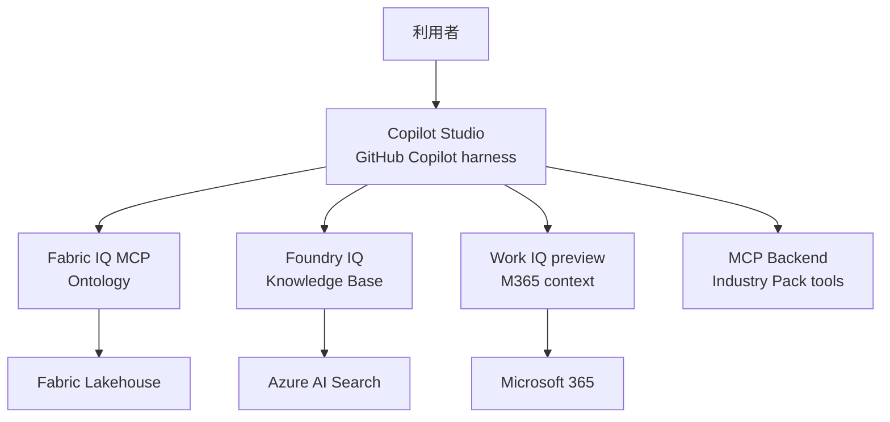

# 本番アーキテクチャガイド

## 1. 方針

本番のオーケストレーション層はMicrosoft Copilot StudioのGitHub Copilot harnessです。Fabric IQ、Foundry IQ、Work IQはCopilot Studioの専用Toolとして接続し、本リポジトリのPython AdapterやローカルOrchestratorを経由しません。

## 2. 責務

- Fabric側: Lakehouse managed table、Ontology、entity type、relationship、data bindingを管理する。
- Foundry/Azure側: Knowledge Source、Indexer/Index、Knowledge Base、retrieval/answer設定を管理する。
- Work IQ/Microsoft 365側: テナント有効化、課金、spending policy、M365ユーザー権限とポリシーを管理する。
- Copilot Studio側: 3つのIQ Tool、認証同意、エージェントInstructions、Activity traceを管理する。
- 本リポジトリ: Industry Pack固有のMCP Toolと、必要な場合のMCP Backendを提供する。

## 3. 関連手順

構築順序と実際の操作は[本番環境構築ガイド](../Production-Environment-Setup.md)を正とします。Azure Container AppsへのMCP Backendデプロイは[deployment/README.md](../deployment/README.md)を参照してください。

## 4. 非責務

IQサービスのSaaSデータ取得を本リポジトリで再実装しません。IQ接続はCopilot StudioのToolが担当します。
