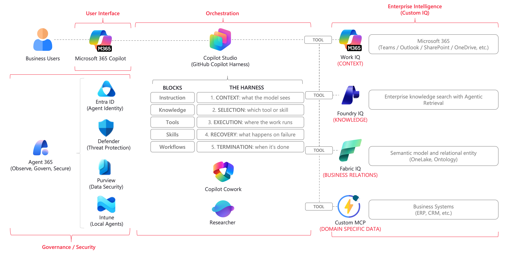

---
hide:
    - navigation
    - toc
---

<section class="lab-hero" markdown>

# Industry IQ Platform Labs

These hands-on labs build industry knowledge from synthetic data and connect Microsoft Fabric IQ, Foundry IQ, and Work IQ to Copilot Studio.

[Start the labs](labs/index.md){ .md-button .md-button--primary }
[Pre-lab checklist](labs/prerequisites.md){ .md-button }

</section>

<!-- Solution icon PNGs: assets/images/solution-icons/{fabric-iq,foundry-iq,work-iq}.png -->

**Fabric IQ**
<small>Bind synthetic Lakehouse data to Ontology entities and relationships.</small>

**Foundry IQ**
<small>Ingest industry documents into a Knowledge Source and validate answers with citations.</small>

**Work IQ**
<small>Review business context from synthetic Microsoft 365 content.</small>

## Lab Structure

| Content | Audience | Duration | Goal |
| --- | --- | ---: | --- |
| Main lab | Solution architects and Copilot Studio authors | 3-4 hours | Select one of five industries, then connect and validate three IQ layers with synthetic data |
| Custom MCP Backend | Advanced users and integration implementers | Optional | Validate an MCP Backend that exposes synthetic data on Azure Container Apps |

<figure class="lab-architecture">
    
    <figcaption>Industry IQ Platform architecture</figcaption>
</figure>

!!! warning "Check Before You Begin"
    This lab uses only each participant's existing tenant and the synthetic data already stored in the repository. Do not use real customer data. If you cannot confirm the required licenses, Preview availability, tenant settings, capacity, and roles, do not begin the setup; consult your administrator.

## Existing References

- [Production environment setup guide](Production-Environment-Setup.md)
- [Ontology design and implementation guide for real customer data](Customer-Data-Ontology-Design-Guide.md)
- [Sample data regeneration guide](reference/Sample-Data-Regeneration-Guide.md)
- [IQ demo data deployment and reconfiguration runbook](evaluation/Demo-Data-Deployment-Runbook.md)
- [Copilot Studio IQ layer test execution and evaluation guide](evaluation/Copilot-Studio-IQ-Layer-Test-Catalog.md)
- [Troubleshooting](troubleshooting/README.md)

The main lab does not replace these documents. It divides UI procedures and acceptance criteria into short units and directs you to the references only for the details you need.
