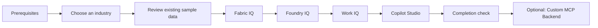

# Lab Guide

 

This click-through lab uses each participant's own Microsoft tenant to configure the Industry IQ Platform. Review the tasks and acceptance criteria on each page before continuing.

## Learning Path

| Content | Data Used | Outcome |
| --- | --- | --- |
| Main lab | Repository-provided `*-SYN-*` data | Validate Fabric IQ, Foundry IQ, and Work IQ from Copilot Studio |
| Optional: Custom MCP Backend | The same synthetic dataset | Validate startup of an MCP endpoint on Azure Container Apps |

!!! warning "Do Not Enter Real Customer Data"
    Do not use real records, credentials, secrets, or personal information in this lab. To design from real customer data, refer to the [Ontology design and implementation guide for real customer data](../Customer-Data-Ontology-Design-Guide.md), not this lab.

## How to Proceed

1. Complete the [prerequisites](prerequisites.md).
2. [Choose an Industry Pack](choose-industry.md).
3. Review the stored sample data.
4. Configure Fabric IQ, Foundry IQ, Work IQ, and Copilot Studio in order.
5. Confirm the **acceptance criteria** on each page.

[Continue to prerequisites](prerequisites.md){ .md-button .md-button--primary }
