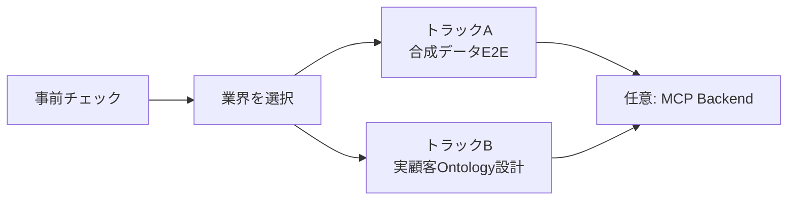

# ラボガイド

このラボは、受講者自身のMicrosoft tenantを使ってIndustry IQ Platformを構成するクリックスルー形式の教材です。各ページで作業、成功条件、証跡を確認してから次へ進みます。

## 学習経路

| トラック | 使用するデータ | 到達点 |
| --- | --- | --- |
| A: 合成データE2E | リポジトリ同梱の`*-SYN-*`データ | Fabric IQ、Foundry IQ、Work IQをCopilot Studioから検証 |
| B: 実顧客Ontology設計 | 既定はmetadataと匿名化sample | 承認可能な用語、entity、property、relationship、binding案を作成 |
| 上級: MCP Backend | 合成datasetまたは承認済みBusiness System | 顧客固有Toolの接続方式を検証 |

!!! warning "実顧客データを入力しない"
    トラックAでは合成データだけを使用します。トラックBでも、Data ownerとSecurity/Privacyの承認がない実レコード、資格情報、Secret、個人情報をAI promptやラボ成果物へ入力しません。

## 進め方

1. [事前チェック](prerequisites.md)を完了する。
2. [Industry Packを選択](choose-industry.md)する。
3. トラックAまたはトラックBを選ぶ。
4. 各ページの**成功条件**を確認する。
5. 指定されたActivity traceと自動検証結果を保存する。

[事前チェックへ進む](prerequisites.md){ .md-button .md-button--primary }
