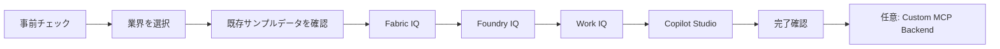

# ラボガイド

 

このラボは、受講者自身のMicrosoft tenantを使ってIndustry IQ Platformを構成するクリックスルー形式の教材です。各ページで作業と成功条件を確認してから次へ進みます。

## 学習経路

| 内容 | 使用するデータ | 到達点 |
| --- | --- | --- |
| メインラボ | リポジトリ同梱の`*-SYN-*`データ | Fabric IQ、Foundry IQ、Work IQをCopilot Studioから検証 |
| 任意: Custom MCP Backend | 同じ合成dataset | Azure Container AppsでMCP endpointの起動を検証 |

!!! warning "実顧客データを入力しない"
    このラボでは実レコード、資格情報、Secret、個人情報を使用しません。実顧客データから設計する場合は、ラボではなく[実顧客データ向けOntology設計・構築ガイド](../Customer-Data-Ontology-Design-Guide.md)を参照してください。

## 進め方

1. [事前チェック](prerequisites.md)を完了します。
2. [Industry Packを選択](choose-industry.md)します。
3. 格納済みサンプルデータを確認します。
4. Fabric IQ、Foundry IQ、Work IQ、Copilot Studioを順番に構成します。
5. 各ページの**成功条件**を確認します。

[事前チェックへ進む](prerequisites.md){ .md-button .md-button--primary }
