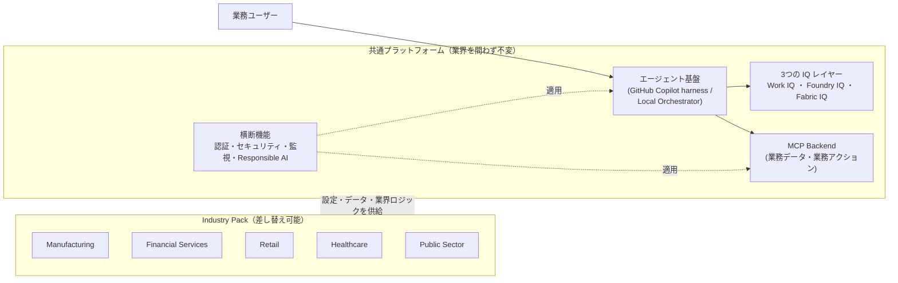
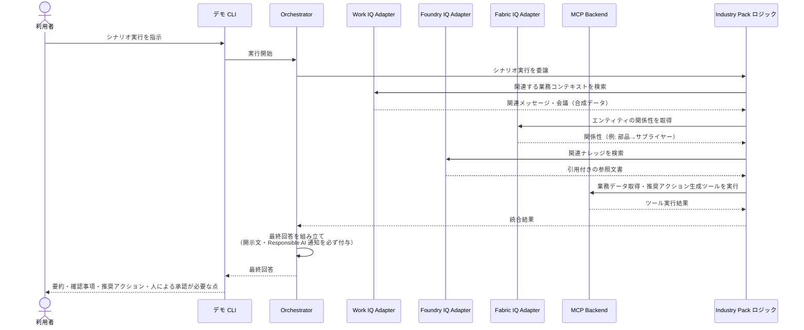
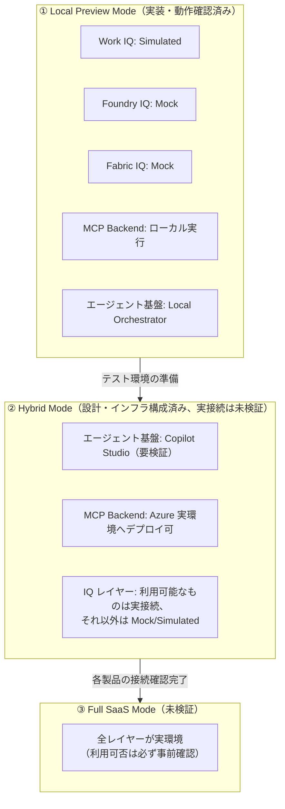
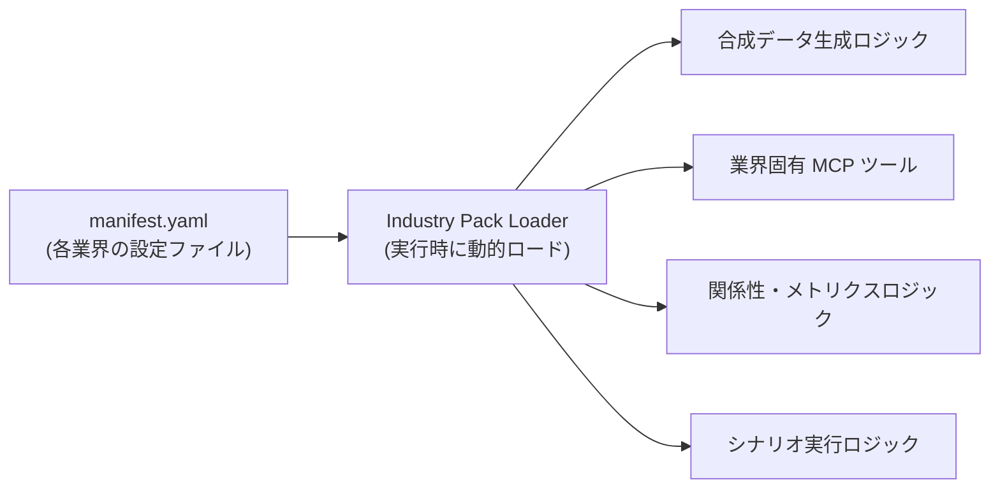
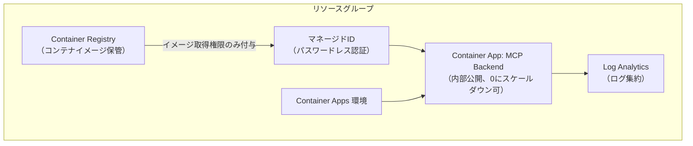
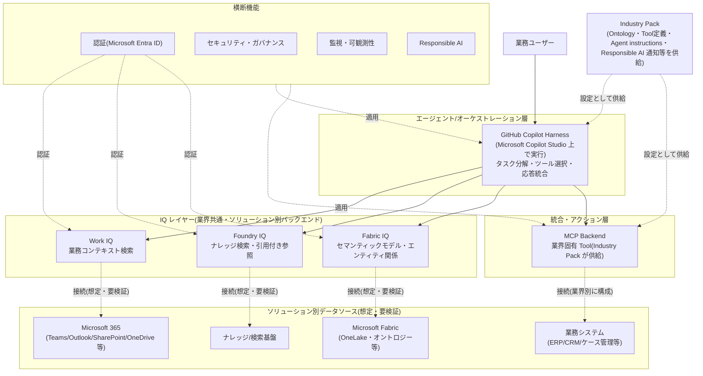
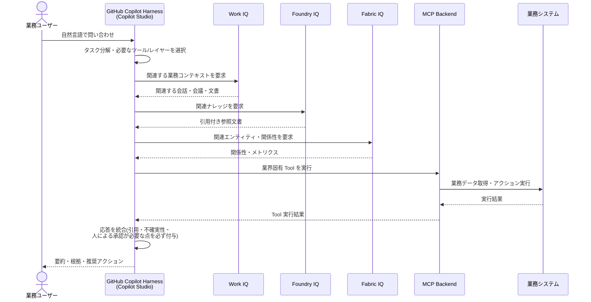

# アーキテクチャ図集（PowerPoint 化用ソース）

> このファイルは顧客向け PowerPoint 資料を作成するための **ソース素材** です。ここに書かれた内部ファイルパス・ADR 番号などの参照はプレゼン資料側にはそのまま転記せず、図と要点の説明文だけを抜き出して使ってください（社外秘/内部専用リンクを顧客向け資料に含めない、instruction §6 準拠）。
>
> 開発者向けの正本は [docs/architecture/architecture-guide.md](../architecture/architecture-guide.md) です。本ファイルはそれを顧客説明用に図として再構成したものであり、内容が食い違った場合は architecture-guide.md を正としてください。
>
> **最終更新**: 2026-09-10(Phase 6 終了時点のコードベース、および本番構成(想定)アーキテクチャ図の追加に基づく)

---

## 図の一覧

| # | 図 | 想定オーディエンス | PPT スライド用途 |
|---|---|---|---|
| 1 | エグゼクティブサマリー図 | 経営層・意思決定者 | コンセプト説明（1枚目） |
| 2 | 詳細レイヤー構成図 | 技術担当者 | アーキテクチャ詳細（技術セッション） |
| 3 | シナリオ実行シーケンス図 | 技術担当者 | 「裏側で何が起きているか」の説明 |
| 4 | 実行モード比較図 | 経営層・技術担当者 | 導入ステップの説明 |
| 5 | Industry Pack 差し替えの仕組み図 | 技術担当者 | 拡張性・再利用性の説明 |
| 6 | Azure デプロイ構成図 | 技術担当者・インフラ担当者 | 本番構成の説明 |
| 7 | 5業界 Industry Pack 比較表 | 全員 | 業界横展開の説明 |
| 8 | 本番構成(想定)全体アーキテクチャ図 | 経営層・技術担当者 | GitHub Copilot Harness を中心とした本番構成の説明 |
| 9 | 本番構成でのデータフロー(想定) | 技術担当者 | 利用者の問い合わせが各レイヤーをどう流れるかの説明 |

---

## 1. エグゼクティブサマリー図

**メッセージ**: 「共通基盤は1つ。業界ごとに変えるのは中身（データ・知識・ルール）だけ」



**スライドに書く要点（3行）**:
- 5業界すべてで同じ基盤・同じ契約（データ形式）を使う
- 業界を切り替えてもプラットフォームのコードは一切変更しない
- 新しい業界の追加は「Industry Pack」を1つ追加するだけ

---

## 2. 詳細レイヤー構成図（技術セッション用）

```mermaid
flowchart TB
    subgraph CLI_UI["デモ CLI"]
        CLI["health / validate / select-industry /<br/>run-demo / evaluate / generate-summary"]
    end

    subgraph Orchestration["オーケストレーション層"]
        GLO["Generic Local Orchestrator<br/>（業界非依存）"]
        IPL["Industry Pack Loader<br/>（動的プラグインロード）"]
    end

    subgraph Adapters["IQ レイヤー Adapter"]
        direction TB
        SWA["Work IQ Adapter<br/>(Simulated)"]
        MKA["Foundry IQ Adapter<br/>(Mock)"]
        MSA["Fabric IQ Adapter<br/>(Mock)"]
        LiveNote["Live Adapter 3種<br/>(認証まで実装、API呼び出しは<br/>製品仕様検証後に有効化)"]
    end

    subgraph MCPBackend["MCP Backend (FastAPI)"]
        Registry["Tool Registry<br/>（汎用 + 業界固有ツール）"]
        App["REST API<br/>/health /tools /tools/&#123;name&#125;/invoke"]
    end

    subgraph Pack["Industry Pack（差し替え対象）"]
        direction TB
        Manifest["manifest.yaml"]
        Gen["合成データ生成"]
        Tools["業界固有 MCP ツール"]
        Sem["関係性・メトリクスロジック"]
        Scenario["シナリオ実行ロジック"]
        Know["ナレッジ文書"]
        Work["業務コンテキスト（模擬）"]
        RAI["Responsible AI 通知"]
    end

    Contracts["共通契約<br/>Agent Response ・ MCP Tool Response ・<br/>Industry Pack Manifest"]

    CLI --> GLO
    GLO --> IPL
    IPL -. 読み込み .-> Manifest
    GLO --> SWA
    GLO --> MKA
    GLO --> MSA
    MSA -. 業界別ロジックに委譲 .-> Sem
    GLO --> Registry
    Registry -. 読み込み .-> Tools
    Registry --> App
    GLO -. 実行委譲 .-> Scenario
    SWA -. 読み込み .-> Work
    MKA -. 読み込み .-> Know
    GLO --> RAI
    GLO --> Contracts
```



**スライドに書く要点**:
- Orchestrator・3つの Adapter・MCP Backend は「業界」という概念を一切知らない
- 業界固有のロジック（データ、ツール、関係性、シナリオ）はすべて Industry Pack 側にある
- 最終回答は共通スキーマ（Agent Response）を必ず経由する

---

## 3. シナリオ実行シーケンス図

**メッセージ**: 「1回の問い合わせで、複数レイヤーを横断して回答を組み立てる」



**スライドに書く要点**:
- 複数のレイヤー（業務コンテキスト・ナレッジ・セマンティック・業務システム）を横断して1つの回答を組み立てる
- 回答には必ず「引用」「不確実性」「人による承認が必要な点」が含まれる
- Mock/Simulation の開示は省略できない設計（必須項目）

---

## 4. 実行モード比較図



**スライドに書く要点**:
- ①は今すぐ、Azure 契約なしで体験できる
- ②③は実環境が必要（現時点では接続検証中）
- どのモードでも「見た目」と「回答の構造」は同じ

---

## 5. Industry Pack 差し替えの仕組み図



**スライドに書く要点**:
- 新しい業界を追加する = 新しい Industry Pack フォルダを1つ追加するだけ
- プラットフォームの再ビルド・再デプロイは不要
- 実際に5業界（製造・金融・小売・医療・行政）で同じ仕組みが動作することを確認済み

---

## 6. Azure デプロイ構成図（技術・インフラ向け）



**スライドに書く要点**:
- サーバーレス的にスケール（未使用時は0台まで縮退しコスト最小化）
- パスワードレス認証（マネージドID）で鍵管理の負担を削減
- 既定は社内限定公開（外部公開は明示的な承認後のみ）

---

## 7. 5業界 Industry Pack 比較表（スライドの表としてそのまま使用可）

| 業界 | 標準シナリオ | 主要エンティティ | 絶対にしないこと |
|---|---|---|---|
| Manufacturing | 品質問題の調査 | 工場・部品・サプライヤー・品質問題・技術変更 | 品質問題の自動クローズ、技術変更の自動承認 |
| Financial Services | 不正取引の調査 | 顧客・口座・取引・不正ケース | 口座の自動凍結、取引の自動拒否・自動与信判断 |
| Retail | 需要と在庫の分析 | 店舗・商品・在庫・注文・需要シグナル | 自動発注、自動価格変更 |
| Healthcare | 診療履歴の確認（完全架空データ） | 架空患者・診療・臨床イベント | 診断の自動確定、治療方針の自動決定、薬剤の自動推奨 |
| Public Sector | 行政ケースの調査（完全架空データ） | 架空市民・機関・ケース・申請 | 給付/許認可の自動決定、市民のリスクランキング |

**スライドに書く要点**:
- どの業界も「調査 → 根拠の提示 → 推奨アクション → 人による最終判断」という同じ流れ
- 高リスクな自動判断は全業界で一貫して禁止

---

## 8. 本番構成(想定)全体アーキテクチャ図

> **重要な前提**: この図は指示書が前提とする**目標構成(想定)**であり、現時点でこの通りに動作するものではありません。エージェント/オーケストレーション層(GitHub Copilot Harness)、および各 IQ レイヤーが接続する具体的な Microsoft ソリューションは、製品仕様・提供状況が未検証のため、図中は必ず「(想定・要検証)」と明記します。現在実際に動作するのは Local Preview Mode(①エグゼクティブサマリー図・④実行モード比較図を参照)のみです。

**メッセージ**: 「本番では GitHub Copilot Harness が中核となり、業界共通の3つの IQ レイヤーがそれぞれのソリューション領域に接続し、MCP Backend が業務データ・業務アクションを仲介する」



**現在の実装状況(正直な対応表)**:

| レイヤー | 本番構成での役割(想定) | 現時点の実装状況 |
|---|---|---|
| GitHub Copilot Harness | 利用者の問い合わせを受け、タスク分解・ツール選択・応答統合を行う | 未接続・未実装。Local Preview Mode では代替のローカルオーケストレーターが動作(本番構成の一部ではない) |
| Work IQ / Foundry IQ / Fabric IQ | それぞれのソリューション領域(業務コンテキスト・ナレッジ・セマンティックモデル)に接続 | 認証まで実装・テスト済み、製品 API 接続は未実装(製品仕様が未検証のため) |
| MCP Backend | 業界別 Tool を通じて業務データ・業務アクションを実行 | 実装・テスト済み。Azure へのデプロイ手順も用意(実デプロイは未検証) |
| ソリューション別データソース | Microsoft 365・ナレッジ基盤・Microsoft Fabric・業務システム等 | 製品名・接続方式とも未検証(合成データでのみ模擬) |

**スライドに書く要点**:
- 本番では GitHub Copilot Harness が唯一のオーケストレーション層になる(独自のオーケストレーターを本番に持ち込む設計ではない)
- 3つの IQ レイヤーは業界を問わず共通で、接続先ソリューションだけが異なる
- Industry Pack が供給するのは「設定・データ・ロジック」のみで、共通レイヤーのコードは変更しない
- 図中の接続関係は目標設計であり、対象 Microsoft ソリューションの提供状況・API 仕様は今後の検証が必要

---

## 9. 本番構成でのデータフロー(想定)

> この図も8と同様に**目標設計**です。矢印は「このような順序でやり取りされる想定」を示すものであり、実際に検証済みのシーケンスではありません。



**スライドに書く要点**:
- 利用者からは1回の問い合わせに見えても、裏側では複数のレイヤーを横断してから回答が組み立てられる
- どのレイヤーが実データに接続しているか(または模擬データか)は必ず開示される設計
- 高リスクな自動アクションは行わず、最終判断は必ず人が行う

---

## PowerPoint への変換方法

Mermaid 記法の図を画像化してスライドに貼り付ける方法（いずれか）:

1. **VS Code**: このファイルをプレビュー表示し、図を右クリックして画像として保存（Mermaid プレビュー拡張機能が必要な場合あり）。
2. **[mermaid.live](https://mermaid.live)**: 各図のコードブロックの中身をコピーして貼り付け、PNG/SVG としてエクスポート。印刷品質が必要な場合は SVG を推奨。
3. **Mermaid CLI**（ローカルに Node.js がある場合）:
   ```bash
   npx @mermaid-js/mermaid-cli -i diagram.mmd -o diagram.png -s 3
   ```
   `-s 3` で高解像度出力（PowerPoint に貼っても粗くならない）。

エクスポートした画像を PowerPoint に貼り付け、各図の「スライドに書く要点」をそのままスピーカーノートまたは箇条書きとして使用してください。
