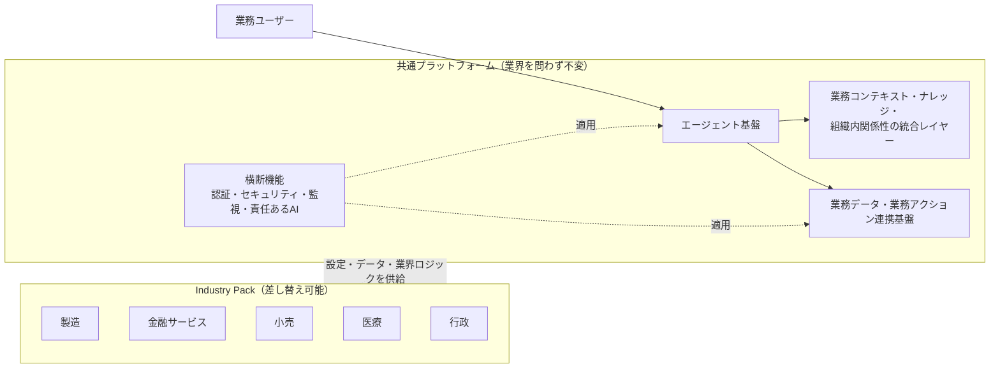

# Executive Presentation（経営層・意思決定者向け）

> Markdown 形式のスライド構成案です（PowerPoint 自動生成が不安定なため、まず Markdown で構成を確定させています）。各 `## Slide N` が1枚のスライドに対応します。図は [Architecture-Diagrams.md](Architecture-Diagrams.md) の Mermaid 図を画像化して挿入してください。発表者向けの詳細な話し方・想定質問は [Speaker-Notes.md](Speaker-Notes.md) を参照してください。
>
> 想定所要時間: 30〜45分（Q&A込み）。想定オーディエンス: 経営層・事業責任者・意思決定者。

---

## Slide 1: タイトル

**Industry IQ Platform Accelerator**
業界特化型 AI アクセラレータ — 共通基盤 × 業界別 Industry Pack

- サブタイトル案: 「1つの基盤、複数業界への横展開」
- 発表日・発表者名を記載

---

## Slide 2: 課題設定

**多くの企業が直面している課題**:

- 業界ごとに AI ソリューションをゼロから作り直しており、開発・保守コストが積み上がっている
- 業界固有の知識（用語、業務プロセス、規制上の制約）と、AI エージェントの土台となる技術基盤が密結合してしまい、他業界への転用が困難
- 生成 AI を業務に組み込む際、根拠の提示・人による最終確認といった責任ある利用の仕組みが後付けになりがち

**問いかけ**: 「業界が変わるたびに、基盤そのものを作り直す必要があるでしょうか？」

---

## Slide 3: コンセプト

**共通の基盤は1つ。業界ごとに変えるのは「中身」だけ。**

- 業界を横断して同じ土台（エージェント基盤・データ連携の仕組み・横断的なガバナンス機能）を再利用
- 業界固有の要素（データ、用語、業務ルール、想定シナリオ、禁止事項）だけを「Industry Pack」として差し替え
- 新しい業界への展開は、基盤の再開発ではなく Industry Pack の追加という形で行う

---

## Slide 4: アーキテクチャ概観

**要点**: 5業界すべてで同じ基盤・同じデータ契約を使用。業界切り替え時にプラットフォーム側のコードは変更しない。

---

## Slide 5: 対応5業界

| 業界 | 標準シナリオ |
|---|---|
| 製造 | 品質問題の調査 |
| 金融サービス | 不正取引の調査 |
| 小売 | 需要と在庫の分析 |
| 医療 | 診療履歴の確認（完全架空データ） |
| 行政 | 行政ケースの調査（完全架空データ） |

いずれの業界も「調査 → 根拠の提示 → 推奨アクション → 人による最終判断」という共通の流れに沿って動作します。

---

## Slide 6: 価値提案

- **開発コストの再利用**: 業界横展開のたびに基盤を作り直さない
- **一貫したガバナンス**: 根拠の提示・不確実性の明示・人による承認プロセスをすべての業界で共通して適用
- **拡張の速さ**: 新しい業界への対応は Industry Pack の追加という限定されたスコープの作業
- **責任ある AI の組み込み**: 自動的な最終判断（承認・却下・診断確定など）は全業界で一貫して行わない設計

---

## Slide 7: 段階的な導入の考え方

- **第一段階（今すぐ体験可能）**: 合成データ・ローカル実行によるプレビュー環境で、コンセプトと基本的な動作を確認
- **第二段階以降（構想・検討段階）**: 実際の業務データや Microsoft 製品との連携は、各製品の仕様・提供状況・ライセンス条件を確認したうえで段階的に検討
- 本資料の時点では、Microsoft 製品（Copilot Studio、Foundry、Fabric 等）との連携は **構想・検討段階** であり、現時点で実際に接続・稼働している機能ではありません。導入を検討される場合は、必ず Microsoft の最新の公式情報でご確認ください。

---

## Slide 8: 責任ある AI と人による最終判断

- すべての回答に「根拠」「不確実性・矛盾点」「人による承認が必要な事項」を明示
- 各業界で「AI に自動判断させない事項」を明文化（例: 口座凍結、診断確定、給付可否決定などは対象外）
- 合成データ・模擬環境で動作している場合は、その旨を回答の中で必ず開示する設計

---

## Slide 9: 現状：証明済みのこと

今回のプレビュー環境で **実際に動作確認済み** の内容:

- 合成データを用いたローカル環境での5業界すべてのシナリオ実行
- 業界切り替え時にプラットフォーム側のコードを一切変更せずに動作すること
- 回答に根拠・不確実性・人による承認事項・責任ある AI に関する開示が必ず含まれること
- 自動化されたテストによる継続的な品質確認の仕組み

---

## Slide 10: 現状：未検証・保留中のこと

**正直にお伝えします。以下はまだ実現していません**:

- Microsoft 製品（Copilot Studio、Work 関連機能、Foundry、Fabric 等）との実接続・実データでの動作
- 実際の Azure 環境への本番デプロイ（構成の設計・準備は完了していますが、実環境への展開・検証はこれから）
- 実際の業務データ・実顧客データでの検証（現時点はすべて合成データ）
- 導入コスト・性能に関する実測値（合成データ・ローカル実行のみのため、実環境での数値は未取得）

---

## Slide 11: 導入に向けたロードマップ案

1. 本日のデモを踏まえたフィードバック収集・要件の具体化
2. 対象業界・対象ユースケースの絞り込み
3. 検証用環境（テスト用のクラウド環境等）での接続検証
4. 実データ・実環境での限定的なパイロット検証
5. 本番展開の判断（コスト・性能・ガバナンス要件を確認したうえで）

各段階で「何が検証済みで、何がまだ検証中か」を明示しながら進めます。

---

## Slide 12: まとめ・次のステップ

- 共通基盤 × Industry Pack で、業界横展開のコストと時間を削減するコンセプトを提示
- 現時点で確認いただけるのは合成データによるプレビュー環境のみであり、実データ・実環境での検証はこれから
- 次のステップ: フィードバックのご共有、優先業界・ユースケースの選定、検証環境の準備についてご相談させてください

---

## 内部参考（社内限定・顧客には見せない）

このセクションは発表準備用の内部メモです。顧客向けスライドの本文には含めないでください。

- 詳細な技術アーキテクチャ図: [Architecture-Diagrams.md](Architecture-Diagrams.md)
- 実装状況の一次情報: [README.md](../../README.md) の実装状況チェックリスト
- Microsoft 製品の検証状況の一次情報: [docs/decisions/product-verification.md](../decisions/product-verification.md)
- Live Adapter の設計判断: [ADR-0013](../decisions/0013-live-adapter-verification-required-scaffold.md)
- デプロイターゲットの設計判断: [ADR-0012](../decisions/0012-mcp-backend-deployment-target.md)
