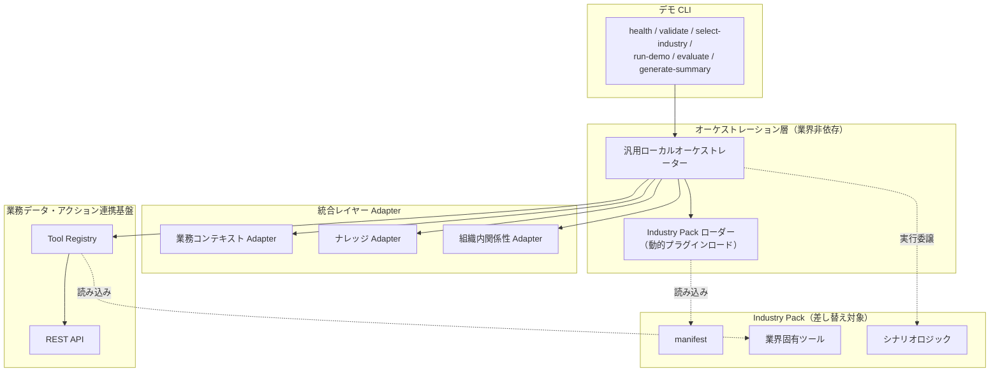
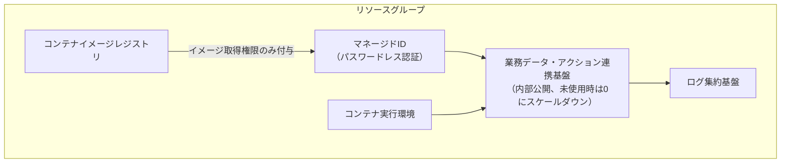

# Technical Presentation（技術担当者向け）

> Markdown 形式のスライド構成案です。各 `## Slide N` が1枚のスライドに対応します。図は [Architecture-Diagrams.md](Architecture-Diagrams.md) の Mermaid 図を画像化して挿入してください。発表者向けの詳細な話し方・想定質問は [Speaker-Notes.md](Speaker-Notes.md) を参照してください。
>
> 想定所要時間: 45〜60分（Q&A込み）。想定オーディエンス: アーキテクト、開発者、インフラ担当者。

---

## Slide 1: タイトル

**Industry IQ Platform Accelerator — 技術アーキテクチャ**

- サブタイトル案: 「契約駆動設計による業界非依存プラットフォーム」
- 発表日・発表者名を記載

---

## Slide 2: スコープと前提

- 本資料は技術的な設計・実装方針の説明を目的とする
- 現時点で実際に動作確認済みなのは、合成データを用いたローカルプレビュー環境のみ
- Microsoft 製品との実接続は構想・検討段階であり、本資料でも実装済みとは説明しない
- 各スライドの末尾に「検証状況」を明示する

---

## Slide 3: アーキテクチャ全体像

**検証状況**: この構成はローカルプレビュー環境で実際に動作確認済み。

---

## Slide 4: Adapter パターン

- 業務コンテキスト、ナレッジ、組織内関係性という3種類の統合レイヤーを、それぞれ共通インターフェースの Adapter として抽象化
- オーケストレーターは Adapter の実装詳細（模擬データか実データか）を意識せず、共通インターフェース越しにのみ呼び出す
- 同一インターフェースに対して、模擬実装（Mock/Simulated）と実環境向け実装（Live）を用意し、切り替え可能な設計とした

**検証状況**: Mock/Simulated 実装は動作確認済み。Live 実装は認証部分のみ実装・単体テスト済みで、実際の製品 API 呼び出しは行っていない（次スライド参照）。

---

## Slide 5: 実行モードの設計思想（mode enum）

Adapter が返す実行モードを明示的な列挙型として定義し、回答の中に必ず含める:

| モード | 意味 |
|---|---|
| `live` | 実環境に実際に接続し、実データで応答している状態 |
| `mock` | 固定的な模擬データで応答している状態 |
| `simulated` | 生成規則に基づく合成データで応答している状態 |
| `unavailable` | 必要な設定・認証情報が不足しており利用できない状態 |
| `verification_required` | 設定は存在するが、接続先製品の仕様自体が未検証のため呼び出しを行わない状態 |

**設計上の意図**: 「本当は実データなのに、あたかも模擬データであるかのように見える」事故と、その逆（模擬データを実データと誤認させる事故）の両方を防ぐこと。回答を受け取った利用者が、常にどのモードで生成された回答かを判別できるようにする。

**検証状況**: 5値すべてが型として実装され、`live` に到達するコードパスが存在しないことをテストで担保している（実際の製品 API 呼び出しコードは、呼び出す前に必ず例外を送出する設計）。

---

## Slide 6: Industry Pack プラグインアーキテクチャ

- 各業界固有の要素（データ生成ロジック、業界用語、業務ツール、組織内関係性ロジック、シナリオロジック、ナレッジ文書、責任ある AI に関する通知文など）を、1つの Industry Pack としてまとめて定義
- Industry Pack はマニフェストファイルによって構造が定義され、実行時に動的に読み込まれる
- プラットフォーム側のコードは、特定の業界名やエンティティ種別をハードコードしない

**検証状況**: 5業界すべてが同一のプラグイン構造に従っており、自動テストで構造の一貫性を検証している。

---

## Slide 7: 業界追加のワークフロー

**新しい業界を追加する際に変更が必要な範囲**:

1. 新しい Industry Pack フォルダを追加（マニフェスト、データ生成ロジック、ツール、シナリオ、ナレッジ、責任あるAI通知等）
2. Industry Pack 側の設定ファイルにマニフェストを記述

**変更が不要な範囲**: オーケストレーター、Adapter の共通インターフェース、業務データ連携基盤の汎用ロジック、契約（データ形式）定義

**検証状況**: 実際に5業界を追加する過程で、プラットフォーム側の共通コードへの業界固有の分岐処理が生まれてしまう事象が一度発生し、設計を修正して業界非依存性を回復させた経緯がある（内部参考セクション参照）。現在は自動テストで業界非依存性を継続的に検証している。

---

## Slide 8: 業務データ・アクション連携基盤の概要

- 業務データの取得や業務アクションの実行を、統一された「ツール」という単位で公開する仕組み
- 汎用的なツール（全業界共通）と、業界固有のツール（Industry Pack 側で定義）を明確に分離
- REST API として実装しており、ヘルスチェック・ツール一覧取得・ツール実行のエンドポイントを持つ

**検証状況**: プロセス内テストクライアント経由での動作は確認済み。実際の Azure 環境へのデプロイ・実運用環境での動作は未検証（Slide 14参照）。

---

## Slide 9: ツールのレスポンス契約

- すべてのツール実行結果は、共通のレスポンススキーマ（実行状態、結果概要、実行モードなど）に従う
- 呼び出し元は、ツールの実装が業界固有であっても、常に同じ形のレスポンスを扱える
- 実行モード（Slide 5 の enum）を各ツール結果にも必ず含める

**検証状況**: 契約はコード上の型定義として実装し、契約に違反するレスポンスを構築できないようにテストで担保している。

---

## Slide 10: エージェント最終回答の契約（14項目）

エージェントが最終的に返す回答は、業界やモードによらず共通のスキーマに従う。主な構成要素:

- エグゼクティブサマリー / 確認済み事実 / 使用したデータソース
- 引用文書一覧 / エンティティと関係性 / ツール実行結果概要
- 不確実性・矛盾点 / 推奨される次のアクション / 人による承認が必要な事項
- 使用した統合レイヤー / 実行モード
- **模擬・合成データに関する開示文（必須項目）**
- **責任ある AI に関する通知文（必須項目）**
- トレース/相関 ID

**設計上のポイント**: 「模擬・合成データに関する開示文」と「責任ある AI に関する通知文」は任意項目ではなく必須項目とし、これらを欠いた回答オブジェクトを構築できないようにしている。

**検証状況**: 契約はコード上の型定義として実装済み。5業界すべての代表シナリオで、この契約に沿った回答が生成されることを自動テストで確認済み。

---

## Slide 11: 責任ある AI の実装への組み込み

- 各業界の Industry Pack が、その業界で「AI に自動判断させてはいけない事項」を明文化し、回答の中で人による承認が必要な事項として明示
- 回答生成のたびに、模擬・合成データである旨と責任あるAIに関する通知文を必ず付与（Slide 10 参照、省略不可の設計）
- 評価エンジン（Slide 12）が、これらの開示が実際に含まれているかを自動チェック

---

## Slide 12: 評価エンジン（ルーブリックベース）

- 各業界・各シナリオに対して、期待される回答の性質をルーブリック（評価基準）として定義
- 評価項目の例: 根拠の提示有無、引用の有無、関係性の提示有無、模擬・合成データ開示の有無、人による承認事項の有無、禁止アクションを推奨していないか
- 自動チェックできない項目は「自動チェック対象外」として明示し、チェック済みであるかのように見せない設計

**検証状況**: 5業界すべての実際のルーブリック定義に対して、実際のオーケストレーターの出力が合格することを自動テストで確認済み。ただし、根拠の妥当性（grounding）などの一部項目は、あくまで代理指標であり、人による最終レビューの代替にはならないことを明示している。

---

## Slide 13: テストカバレッジ

| カテゴリ | 目的 |
|---|---|
| Contract | 契約（データ形式）定義そのものの妥当性 |
| Unit | 個々のコンポーネントの単体動作 |
| Integration | 複数コンポーネントを組み合わせた際の動作 |
| End-to-end | CLI からの一連のシナリオ実行 |
| Evaluation | ルーブリック評価エンジンの動作 |
| Security | 認証情報の取り扱い・シークレット混入の検出等 |

- 現時点で137件の自動テストがこれらのカテゴリに分かれて存在し、継続的に実行されている
- 「テストを削除・無効化して成功扱いにする」ことは行わない方針を徹底している

---

## Slide 14: デプロイアーキテクチャ

- サーバーレス的にスケールする構成（未使用時は最小構成まで縮退）
- パスワードレス認証（マネージドID）を採用し、鍵管理の負担を軽減
- 既定は内部限定公開。外部公開は明示的な承認プロセスを経た場合のみ

**検証状況**: インフラ定義コードのコンパイル検証・CI 上でのコンテナビルド検証は完了しているが、実際の Azure サブスクリプションへのデプロイ・実環境での動作検証はまだ実施していない。

---

## Slide 15: 実装状況とロードマップ（正直な現状）

**動作確認済み（ローカルプレビュー環境）**:
- 5業界すべての契約準拠・自動テスト・評価エンジン・CLI 一連のフロー

**実装済みだが未検証**:
- Live Adapter の認証部分（実テナントでの検証は未実施）
- Azure デプロイ基盤一式（実サブスクリプションへのデプロイは未実施）

**未着手・未検証**:
- Microsoft 製品との実際の API 連携（製品仕様自体が未検証のため）
- 実データ・実運用環境での性能・コスト測定

**次のステップ**: 検証用環境の確保、Live Adapter の実接続検証、実 Azure 環境への試験デプロイ

---

## 内部参考（社内限定・顧客には見せない）

このセクションは発表準備用の内部メモです。顧客向けスライドの本文には含めないでください。

- Adapter 契約の設計判断: [ADR-0003](../decisions/0003-adapter-contract-and-mode-enum.md)
- Industry Pack マニフェストスキーマ: [ADR-0004](../decisions/0004-industry-pack-manifest-schema.md)
- Agent Response 契約: [ADR-0005](../decisions/0005-agent-response-contract.md)
- MCP Tool レスポンス契約: [ADR-0006](../decisions/0006-mcp-tool-response-contract.md)
- Industry Pack プラグインロードの仕組み: [ADR-0010](../decisions/0010-industry-pack-plugin-loading.md)
- 汎用オーケストレーター化の経緯（Slide 7 の「一度発生した事象」の詳細）: [ADR-0011](../decisions/0011-generic-orchestrator-and-semantic-adapter.md)
- MCP Backend デプロイターゲットの設計判断: [ADR-0012](../decisions/0012-mcp-backend-deployment-target.md)
- Live Adapter verification_required スキャフォールドの設計判断: [ADR-0013](../decisions/0013-live-adapter-verification-required-scaffold.md)
- コード構成の詳細: [docs/architecture/architecture-guide.md](../architecture/architecture-guide.md)
- 実装状況の一次情報: [README.md](../../README.md) の実装状況チェックリスト
