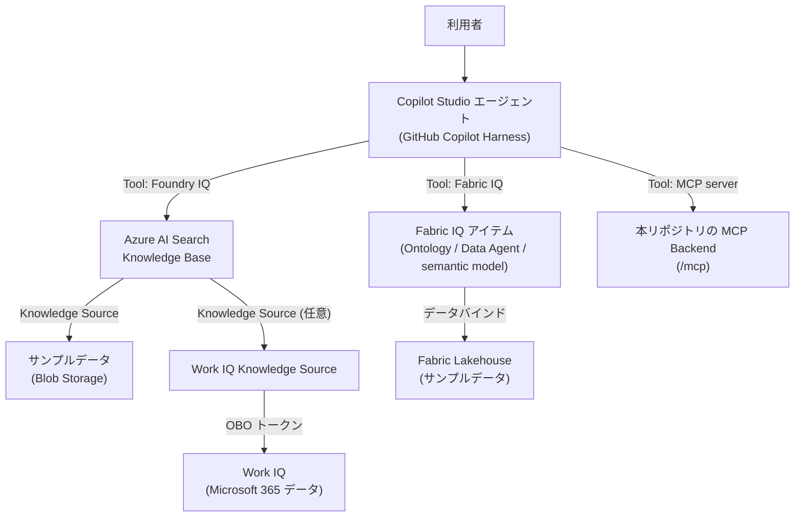

# Fabric IQ / Foundry IQ / Work IQ 本番接続環境構築ガイド

> **状態**: このガイドは 2026-09-11 に指定URLと関連する Microsoft Learn / Microsoft Azure GitHub ドキュメントを再調査して更新したものです。各手順には出典 URL を明記しています。**このリポジトリの開発環境では実際にこの手順を最後まで実行した実績はありません**(実 Azure/Microsoft 365 テナントへのアクセスがないため)。手順通りに進めても想定外の挙動に遭遇した場合は、本ガイドを実測結果で更新してください。
>
> **対象読者**: [docs/deployment/Step-by-Step-Deployment-Guide.md](../deployment/Step-by-Step-Deployment-Guide.md) のステップ6〜11(Entra ID 登録・Work IQ/Foundry IQ/Fabric IQ 設定・Copilot Studio harness 設定)を終えた後、実際に Fabric IQ・Foundry IQ・Work IQ を**実データで動作する状態**まで構築したい開発者・管理者。
>
> **前提**: オーケストレーション層は Microsoft Copilot Studio の GitHub Copilot Harness です([ADR-0014](../decisions/0014-local-orchestrator-is-not-a-harness-replacement.md)、[ADR-0016](../decisions/0016-copilot-studio-github-harness-confirmed.md))。Fabric IQ は **Fabric IQ MCP (Preview)** をCopilot StudioのToolとして追加します。Foundry IQはAzure AI Foundry / Azure AI Search側で作成・権限付与したKnowledge Baseを、Copilot StudioのFoundry IQ Toolから選択します。Work IQは **Copilot Studioの専用Work IQ (preview) Tool** として、Tools > Add Tool > Model Context Protocol > Work IQ から接続します。3つともGitHub Copilot Harnessを前提とし、Work IQはWork IQ専用の接続作成・同意フローを使用します。

## 0. 全体像



この図は本ガイドの手順が構築する構成の要約です。個々の矢印の詳細と出典は各 Part を参照してください。

## 1. 全体の前提条件チェックリスト

| # | 項目 | 出典 |
|---|---|---|
| 1 | Azure サブスクリプション(Foundry / Azure AI Search / Storage 用) | 各 Part 参照 |
| 2 | Microsoft Fabric が有効な容量(F2 以上、または Fabric 有効化済み Power BI Premium P1 以上) | [Fabric data agent 前提条件](https://learn.microsoft.com/en-us/fabric/data-science/how-to-create-data-agent) |
| 3 | Microsoft Copilot Studio の使用量ベース課金プラン(Azure サブスクリプション + リソースグループを割り当て済み) | [Work IQ を有効化する](https://learn.microsoft.com/en-us/microsoft-365/copilot/extensibility/work-iq/enable-work-iq) |
| 4 | Microsoft Entra ID Global Administrator ロール(Work IQ 有効化・管理者同意用、一時的な PIM 昇格を推奨) | 同上、および [Fabric IQ 認証設定](https://learn.microsoft.com/en-us/azure/foundry/agents/how-to/tools/fabric-iq) |
| 5 | Azure AI Search サービス(agentic retrieval 対応リージョン) | [Foundry IQ Knowledge Base 作成](https://learn.microsoft.com/en-us/azure/search/agentic-retrieval-how-to-create-knowledge-base) |
| 6 | (LLM を使う場合)Azure OpenAI in Foundry Models のモデルデプロイ | 同上 |

**コストに関する注記**: このガイドで作成するリソース(Azure AI Search、Fabric 容量、Azure OpenAI 等)には課金が発生します。金額は本ガイドでは一切確定しません。[docs/cost/README.md](../cost/README.md) の方針に従い、実行前に Azure Pricing Calculator 等で見積もりを確認し、`docs/decisions/product-verification.md` にその結果を追記してください。

---

## Part A: Fabric IQ(Ontology / Fabric Data Agent)の構築

### A-1. Fabric ワークスペースの準備

Fabric IQ の Ontology(プレビュー)アイテムを使うには、Fabric ワークスペースにテナント設定「Ontology item (preview)」が有効になっている必要があります([Bind Data 前提条件](https://learn.microsoft.com/en-us/fabric/iq/ontology/how-to-bind-data) より、詳細な有効化手順は `overview-tenant-settings#ontology-item-preview` を参照 — このリポジトリでは未確認、Fabric 管理センターで確認してください)。

### A-2. Lakehouse の作成とサンプルデータの投入

1. Fabric ワークスペースを開き、**+ New item** → **Lakehouse** を選択します。名前はアルファベットで始まり、英数字とアンダースコアのみ(123文字以内)。([Create a lakehouse](https://learn.microsoft.com/en-us/fabric/data-engineering/create-lakehouse))
2. サンプルデータの投入方法(いずれか):
   - **パイプラインでのコピー**: **+ New item** → **Pipeline** → **Copy data** アクティビティで、任意のソース(Azure Blob 等)から Lakehouse の `Files` 配下にコピーします。([Lakehouse tutorial - Ingest data](https://learn.microsoft.com/en-us/fabric/data-engineering/tutorial-lakehouse-data-ingestion) — このチュートリアルは Microsoft 提供の公開サンプルデータ `https://fabrictutorialdata.blob.core.windows.net/sampledata/`(Wide World Importers)を使う例で、匿名認証で接続可能です。本リポジトリの合成データ(`industry-packs/*/sample-data/` 生成物)を使う場合は、まず任意の Blob Storage コンテナーにアップロードしてから同様にコピーしてください)。
   - **直接アップロード**: Lakehouse Explorer の **Files** に直接ファイルをアップロードし、テーブルとして読み込む方法もあります(具体的なクリック手順は [Load data into a lakehouse](https://learn.microsoft.com/en-us/fabric/data-engineering/load-data-lakehouse) を参照 — このリポジトリでは未確認、`TBD - VERIFY AGAINST CURRENT MICROSOFT DOCUMENTATION`)。
3. Ontology のデータバインドは **managed** な Lakehouse テーブル(OneLake セキュリティ無効・列マッピング無効)のみサポートされるため([Bind Data の制限事項](https://learn.microsoft.com/en-us/fabric/iq/ontology/how-to-bind-data#limitations-and-troubleshooting))、生ファイルのままではなく **テーブルとして読み込む** 必要があります。

### A-3. Ontology(プレビュー)アイテムの作成とエンティティ型の定義

**確認できた事実**: Ontology アイテムは *entity types*(実体の型、例: Product・Order)・*properties*(プロパティ)・*relationships*(関係)・*data binding*(データ結合)から構成されます([What Is Ontology (Preview)?](https://learn.microsoft.com/en-us/fabric/iq/ontology/overview))。

**Ontology アイテムの新規作成(前提設定含む)**:

1. Fabric 管理者は、管理ポータルの [テナント設定](https://learn.microsoft.com/en-us/fabric/iq/ontology/overview-tenant-settings) で **Enable Ontology item (preview)** を有効化する(未設定の場合、新規 Ontology アイテム作成時にエラーになります)。Fabric Data Agent と組み合わせる場合は [Fabric data agent のテナント設定](https://learn.microsoft.com/en-us/fabric/data-science/data-agent-tenant-settings) も併せて有効化してください。
2. Fabric ワークスペースを開き、**+ New item** → **Ontology (preview)** を検索して選択する。名前を入力し、**Create** を選択する。これは [Tutorial Part 1: Create an Ontology](https://learn.microsoft.com/en-us/fabric/iq/ontology/tutorial-1-create-ontology) のOneLake作成手順で明記されています。

3. Ontologyの作成方法を選ぶ。既存のPower BI semantic modelから生成する方法と、OneLakeテーブルから直接構築する方法があります。本リポジトリのサンプルデータを使う場合は **Build directly from OneLake** の手順を使います。semantic modelを使う場合は、先にsemantic modelを発行し、そのモデルの **Generate Ontology** からWorkspace・Ontology名を指定します。

4. OneLake方式では、Home設定キャンバスで **Add entity type** → エンティティ型名 → **Add Entity Type** を選択します。続けて **... > Bind data** → **Add data binding > Lakehouse table** → Lakehouse → テーブルを選択します。列がプロパティとして表示されたら、**Define entity type key** で一意キーを指定し、データバインドを保存します。

**エンティティ型・リレーションシップの作成**(確認済み、[Create Entity Types](https://learn.microsoft.com/en-us/fabric/iq/ontology/how-to-create-entity-types)、[Tutorial Part 1](https://learn.microsoft.com/en-us/fabric/iq/ontology/tutorial-1-create-ontology)):

1. Ontology アイテムの Home 設定キャンバスで、トップリボンまたはキャンバス中央の **Add entity type** を選択。
2. エンティティ型名を入力し(1〜26文字、英数字・ハイフン・アンダースコアのみ、先頭/末尾は英数字)、**Add Entity Type** を選択。キャンバスに新しいエンティティ型が表示されます。
3. **プロパティの追加**(データバインドと同時でも、事前でも可): エンティティ型名を選択 → 上部リボンの **View entity type details** → **Configure** タブ → **Manage property bindings** を展開 → **Add properties** を選択。各プロパティに名前と型(または型を指定せず `Define at binding` を選び、データバインド時に型を確定する「型なしプロパティ」)を設定して **Save**。
   - プロパティ名は同一エンティティ型内で重複不可・1〜26文字の制約あり。異なるエンティティ型間では同名でも型が同じなら重複可。
4. 必要に応じて、いずれかのプロパティを **display name property**(下流の表示名)として指定。
5. エンティティ型の削除は Explorer 上で **... > Delete entity type** から行う(関連する entity type key・relationship type の設定も連動して削除される点に注意)。

6. 複数のエンティティ型を作成したら、起点となるエンティティ型を選択し、リボンの **Add relationship** または **... > Add relationship type** を選択する。関係名、Origin entity type、Target entity typeを指定して **Create**。
7. 作成した関係を選択し、**Mapping table** と、Origin/Targetのentity type keyに対応する **Matched** 列を指定して保存する。たとえば `SaleEvent` と `Store` を結ぶ場合、`factsales` をMapping tableに指定し、`SaleId` と `StoreId` をそれぞれのキーに対応させる。

データバインドの手順(確認済み、[Bind Data](https://learn.microsoft.com/en-us/fabric/iq/ontology/how-to-bind-data)):

1. Ontology の Home 設定キャンバスまたは entity type の **Configure** タブから **Bind data** を選択。
2. **Add data binding** で OneLake のデータソース種別を選び、対象テーブルを選択。
3. **Entity type key**(一意キーとなる列)と **Properties**(列→プロパティのマッピング)を設定して保存(静的データバインド)。
4. 必要に応じて時系列データ(Eventhouse または Lakehouse)を追加バインド(静的バインド完了後のみ可能)。
5. 上流データの更新はグラフモデルへ自動反映されないため、[refresh the graph model](https://learn.microsoft.com/en-us/fabric/iq/ontology/how-to-view-entity-type-details) の手順で手動更新が必要です。

サポートされるプロパティ型・制限事項(managed テーブルのみ、1エンティティ型につき静的バインドは1ソースのみ 等)は上記ページの表を参照してください。

### A-4. (任意)Fabric Data Agent の作成

Ontology の代わり、または加えて、会話型 Q&A を提供する Fabric Data Agent を作成できます([Create a Fabric data agent](https://learn.microsoft.com/en-us/fabric/data-science/how-to-create-data-agent)、[概念ページ](https://learn.microsoft.com/en-us/fabric/data-science/concept-data-agent))。

1. ワークスペースで **+ New Item** → **Fabric data agent** を選択し、名前を入力。
2. データソースを最大5個(組み合わせ自由: Lakehouse・Warehouse・Power BI semantic model・KQL データベース・Ontology・Microsoft Graph)追加し、使用するテーブルを選択。
3. **Data agent instructions**(最大15,000文字)と **Example queries** で挙動を調整(任意)。
4. **Publish** で公開。公開時に入力する説明文は、外部オーケストレーター(Copilot Studio 等)がこの Data Agent をいつ呼び出すべきか判断する材料になります。
5. 認証は不要(Fabric がユーザーの Entra ID 資格情報とワークスペース権限で動作、Microsoft 管理の Azure OpenAI Assistant を使用)。読み取り専用(SQL/DAX/KQL の生成・実行はすべて読み取りクエリのみ)。

**ガバナンス**: Microsoft Purview の DLP・アクセス制限ポリシーが設定されている場合、Fabric Data Agent はそのポリシーに従います([Governance and security](https://learn.microsoft.com/en-us/fabric/data-science/concept-data-agent#governance-and-security))。

### A-5. Copilot Studio エージェントへの Fabric IQ(Ontology MCP)接続

FabricのOntologyをCopilot Studioから使う場合は、一般的なFabric IQの選択だけでなく、[Create an Ontology Agent with Copilot Studio](https://learn.microsoft.com/en-us/fabric/iq/ontology/how-to-create-agent-copilot-studio) に記載された **Fabric IQ MCP (Preview)** とOntology固有の接続情報を使います。

1. Copilot StudioのProduction environmentで、Fabric workspaceと同じユーザーでサインインする。前提として、Ontology MCP toolsが許可された環境と、対象Ontologyを含むFabric workspaceへのアクセス権が必要です。
2. **Agents** → **+ Create blank agent** で新しいエージェントを作成する。
3. エージェントの **Tools** → **+ Add tool** → **Fabric IQ MCP (Preview)** を選択する。
4. Connectionのドロップダウンから **Create new connection** を選び、Authentication typeは既定の **Login with Microsoft Entra ID** を使用する。
5. FabricのOntology URL `https://app.fabric.microsoft.com/groups/<workspace-ID>/ontologies/<ontology-item-ID>` からWorkspace IDとOntology IDを取得し、接続画面に入力して **Create**、続けて **Add** を選択する。
6. 追加されたToolの詳細を開き、`list_ontology_entity_types` と `search_ontology` が表示されることを確認する。
7. Testペインで質問し、MCP Toolの利用許可が求められたら **Allow** → **Open connection manager** → **Connect** → **Retry** の順で接続して回答を確認する。

Ontologyを他のMCPクライアントから使う場合の公式Endpointは `https://api.fabric.microsoft.com/v1/mcp/dataPlane/workspaces/<workspace-ID>/items/<ontology-item-ID>/ontologyEndpoint` です。Copilot Studioでは上記のFabric IQ MCP専用Toolを優先し、汎用MCP URL入力に置き換えないでください。

---

## Part B: Foundry IQ(Azure AI Search Knowledge Base)の構築

### B-1. 前提条件とFoundry側の構成

- Copilot StudioとMicrosoft Foundry(Azure AI Foundry)プロジェクトは**同じMicrosoft Entra tenant**に置く。指定されたAzureの教育用ラボでも、この同一tenant要件が明記されています。異なるtenant間の構成はこのガイドの対象外です。
- Agentic retrieval対応リージョンのAzure AI Searchサービスを用意する。Managed Identityでモデルにアクセスする場合はBasic以上が必要です。
- Microsoft Foundryでプロジェクトを作成または既存プロジェクトを選択し、**Build > Knowledge**からAzure AI Searchを接続する。Azure AI Search接続がプロジェクトに存在しない場合は、先に接続を作成します。
- 検索サービスに対して、作成者ユーザーへ **Search Service Contributor** を付与する。Keyless構成では検索・インデックス操作に必要なデータプレーンRBACも付与し、プロジェクトのManaged Identityを使う場合は **Search Index Data Reader** 等を必要範囲で付与します。
- Knowledge BaseにLLMを指定する場合、Azure AI SearchのManaged IdentityにMicrosoft Foundryリソースの **Cognitive Services User** を付与する。LLMを使わない最小抽出検索と、query planning/answer synthesisを使うプレビュー構成では必要条件が異なります。
- 作成者はAzure AI SearchのKnowledge SourceとKnowledge Baseを構成できる権限を持つこと。
([Create a Knowledge Base](https://learn.microsoft.com/en-us/azure/search/agentic-retrieval-how-to-create-knowledge-base)、[What is Foundry IQ?](https://learn.microsoft.com/en-us/azure/foundry/agents/concepts/what-is-foundry-iq)、[指定GitHubラボ](https://github.com/Azure/Copilot-Studio-and-Azure/tree/main/labs/2.4-microsoft-foundry-agentic-retrieval))

### B-2. Foundry IQ Knowledge Sourceとサンプルデータの投入

合成データ(このリポジトリの `industry-packs/*/knowledge/*.md` 等)を最も簡単に投入する方法はBlob Knowledge Sourceです。Microsoft Foundryポータルの **Build > Knowledge** からKnowledge Sourceを1つずつ作成する方法と、Azure AI Search REST/SDKで作成する方法があります。指定GitHubラボは教育用で本番推奨ではありませんが、サンプル文書生成・インデックス・Knowledge Source・Knowledge Base・Foundry Agent作成の流れを確認する補助資料として利用できます。

1. Azure Blob Storage アカウント・コンテナーを作成し、サンプルデータファイル(対応形式は [blob indexer のドキュメント](https://learn.microsoft.com/en-us/azure/search/search-how-to-index-azure-blob-storage#supported-document-formats)参照)をアップロードする。
2. Azure AI Search の管理 ID に、対象ストレージアカウントで **Storage Blob Data Reader** ロールを付与する。
3. `AzureBlobKnowledgeSource` を作成する(REST 例):

   ```http
   PUT {{search-endpoint}}/knowledgesources/my-blob-ks?api-version=2026-04-01
   Authorization: Bearer {{search-access-token}}
   Content-Type: application/json

   {
     "name": "my-blob-ks",
     "kind": "azureBlob",
     "description": "合成サンプルデータのナレッジソース",
     "azureBlobParameters": {
       "connectionString": "ResourceId=<storage-resource-id>",
       "containerName": "<blob-container-name>",
       "isADLSGen2": false,
       "ingestionParameters": {
         "chatCompletionModel": { "kind": "azureOpenAI", "azureOpenAIParameters": { "resourceUri": "{{aoai-endpoint}}", "deploymentId": "{{aoai-gpt-deployment}}", "modelName": "{{aoai-gpt-model}}" } },
         "embeddingModel": { "kind": "azureOpenAI", "azureOpenAIParameters": { "resourceUri": "{{aoai-endpoint}}", "deploymentId": "{{aoai-embedding-deployment}}", "modelName": "{{aoai-embedding-model}}" } }
       }
     }
   }
   ```

   これにより、データソース・スキルセット(チャンク化・ベクトル化)・インデックス・インデクサーが自動生成されます。作成後、`GET {{search-endpoint}}/knowledgesources/my-blob-ks/status` で取り込み状況(`itemUpdatesProcessed`/`itemsUpdatesFailed`)を確認できます。

他の Knowledge Source 種別(Azure SQL・File・OneLake・SharePoint・Fabric Data Agent・Fabric Ontology・MCP server・Web)も同じ仕組みでサポートされています([What is a Knowledge Source?](https://learn.microsoft.com/en-us/azure/search/agentic-knowledge-source-overview) の一覧表参照)。**Fabric Data Agent / Fabric Ontology を Knowledge Source として Foundry IQ に取り込むことも可能**です(Part A で作成したアイテムをここに接続する代替経路)。

### B-3. Knowledge Base の作成とFoundry側の検証

```http
PUT {{search-endpoint}}/knowledgebases/my-kb?api-version=2026-04-01
Authorization: Bearer {{search-access-token}}
Content-Type: application/json

{
    "name" : "my-kb",
    "description": "Industry IQ Platform Accelerator 用ナレッジベース",
    "knowledgeSources": [ { "name": "my-blob-ks" } ],
    "encryptionKey": null
}
```

([Create a Knowledge Base](https://learn.microsoft.com/en-us/azure/search/agentic-retrieval-how-to-create-knowledge-base)。`2026-04-01` は一般提供(GA)版 REST API。プレビュー機能(query planning・answer synthesis 等)が必要な場合は `2026-08-01-preview` を使用)

Foundryポータルを使う場合は、**Build > Knowledge > Create knowledge base** でKnowledge Sourceを追加し、retrieval instructions、answer instructions、output mode、reasoning effort、必要ならAzure OpenAIモデルを設定して保存します。Knowledge BaseがFoundry IQの共有資産であり、Copilot Studioで作り直すものではないことを確認してください。保存後、Foundry側でKnowledge BaseのPlaygroundまたはRetrieve/MCP endpointを使い、サンプル質問・引用・activityを確認します。Work IQ Knowledge Sourceを含む場合は、Part CのユーザーAssertionと`maxRuntimeInSeconds >= 120`も検証します。

### B-4. Copilot Studio エージェントへの Foundry IQ 接続

確認済み手順([Connect to Foundry IQ from an agent - Microsoft Copilot Studio](https://learn.microsoft.com/en-us/microsoft-copilot-studio/agents-experience/foundry-iq-connect)):

1. Copilot StudioとMicrosoft Foundryプロジェクトが同じtenantにあること、対象Knowledge Baseへのアクセス権があることを確認する。Copilot Studio側でKnowledge Baseを作成するのではなく、Foundry/Azure AI Search側で作成済みのKnowledge Baseを選択します。
2. Copilot Studio でGitHub Copilot harnessのエージェントを開き、**Build** タブ → コンポーネントパネルの **Tools** → **Foundry IQ** を選択。
3. **Create new connection** を選び、**Authentication type** を選択(**API key** / **Client Certificate Auth** / **Service principal (Microsoft Entra ID application)** / **Microsoft Entra ID Integrated** のいずれか)。
   - API Key の場合: Azure AI Search サービスのエンドポイント + API キーを入力。
   - Service principal の場合: エンドポイント + テナント ID + クライアント ID + クライアントシークレットを入力。
4. 接続作成後、**Knowledge Base**(B-3でFoundry側に作成したもの)を選択し、**Add to agent**。
5. **Save**。Toolの名前・説明を分かりやすく編集する(説明文がオーケストレーションの精度に影響)。
6. **Preview** タブでテスト質問を送り、Activity traceでFoundry IQのretrieval stepと返却された項目を確認する。結果が不十分な場合はCopilot StudioではなくFoundry側のKnowledge Source、retrieval instructions、rankingを調整します。

**注意**: 1エージェントにつきFoundry IQ接続は1つのみです。複数のKnowledge Baseを使い分けたい場合は、Knowledge Base側でKnowledge Sourceを束ねるか、Foundry Agentを別途構成する設計を検討してください。Copilot Studioから接続を削除しても、Foundry側のKnowledge Baseは削除されません。

---

## Part C: Work IQ の有効化と Copilot Studio 接続

### C-1. テナントの Work IQ 有効化(一度きり)

前提([Enable your tenant for Work IQ](https://learn.microsoft.com/en-us/microsoft-365/copilot/extensibility/work-iq/enable-work-iq)):

- Copilot Studio に Azure サブスクリプション・リソースグループを割り当てた使用量ベース課金プランが設定済み。
- Global Administrator ロールを持つユーザー(一度きりのテナント設定)。

有効化手順(いずれか、所要時間約5分・組織につき一度きり):

- **Graph Explorer**: POST `https://graph.microsoft.com/v1.0/servicePrincipals`、リクエストボディ `{"appId": "fdcc1f02-fc51-4226-8753-f668596af7f7"}`。`201 Created` で成功、既存なら競合エラー。
- **Azure CLI**: `az ad sp create --id fdcc1f02-fc51-4226-8753-f668596af7f7`

### C-2. Copilot Studio から Work IQ (preview) を追加する

**確認できた事実**([Work IQ in Microsoft Copilot Studio](https://learn.microsoft.com/en-us/microsoft-copilot-studio/add-work-iq)、[Microsoft Work IQ API](https://learn.microsoft.com/en-us/microsoft-365/copilot/extensibility/work-iq/api-overview)):

 - Work IQ (preview) はCopilot Studioで利用可能で、**GitHub Copilot Harness** によって動作し、Copilot Creditsの使用量ベース課金を使用します。これはPreview機能です。
 - Work IQはMCPサーバーを通じてメール、予定表、Teams等の仕事のコンテキストを提供します。Microsoft 365 admin centerで管理する中央ガバナンスと、ユーザーのEntra ID資格情報による権限境界が適用されます。
 - Work IQは読み取り専用が既定で、書き込み操作を使う場合は管理者がMicrosoft 365 admin centerで明示的に有効化します。またWork IQ用の別個のspending policyが必要です。

**Copilot Studio側の手順**([Work IQ in Microsoft Copilot Studio](https://learn.microsoft.com/en-us/microsoft-copilot-studio/add-work-iq)):

1. C-1のテナント有効化と課金設定を完了し、Work IQを使うユーザーが対象のCopilot Studio環境にアクセスできることを確認する。
2. Copilot StudioでGitHub Copilot Harnessのエージェントを選択または作成する。
3. **Tools** タブ → **Add Tool** → **Model Context Protocol** を選択する。
4. 一覧から **Work IQ (preview)** を選択し、接続ドロップダウンで **Create New Connection** を選択する。
5. **Create** を選択し、表示された認証画面でユーザー資格情報を入力してサインインする。
6. **Add and Configure** を選択してエージェントへ追加する。
7. **Test** でメールや予定表のコンテキストを必要とする質問を実行する。Work IQ MCPの接続許可を求められた場合は **Allow** を選択する。
8. エージェントの応答とActivity traceを確認する。書き込みを含むテストを行う場合は、先にテナントポリシーとWork IQ用spending policyを管理者が確認する。

この手順ではRemote MCPのURLを手入力しません。Copilot StudioのWork IQ (preview)項目が表示されない場合は、Preview機能、GitHub Copilot Harness、テナントのWork IQ有効化、課金設定、地域での機能提供状況を確認してください。Preview機能のため、本番利用可否は現在のMicrosoft公式条件を再確認してください。

### C-3. Foundry IQ Knowledge Base に Work IQ を組み込む(代替経路)

**Work IQはAzure AI SearchのKnowledge Sourceの1種類としてもサポートされています**([What is a Knowledge Source?](https://learn.microsoft.com/en-us/azure/search/agentic-knowledge-source-overview)、[Create a Work IQ Knowledge Source](https://learn.microsoft.com/en-us/azure/search/agentic-knowledge-source-how-to-work-iq))。ただし、Copilot StudioでWork IQを利用する主経路はC-2の専用Work IQ (preview) Toolです。C-3は、Work IQをFoundry IQのKnowledge Baseに統合して検索計画の一部として扱う必要がある場合の代替構成です。**この構成ではWork IQ Knowledge Source固有のEntra/OBO設定が別途必要**で、Copilot StudioのWork IQ接続設定を代用するものではありません。

手順(`2026-08-01-preview` API 版が必要、GA 版では未対応):

1. **カスタム所有の Entra アプリ登録**を作成(サポート対象アカウント種別: 自組織のみ)。
2. アプリの **Expose an API** で、**厳密に `access_as_user`** という名前の委任スコープを追加(他の名前不可)。
3. アプリの **API permissions** で「APIs my organization uses」から Work IQ(アプリケーション ID `fdcc1f02-fc51-4226-8753-f668596af7f7`)を検索し、**Delegated permissions** → **WorkIQAgent.Ask** を追加。
4. 管理者が **Grant admin consent** を実行。
5. Azure AI Search サービスに **system-assigned managed identity** を有効化し、その **Object (principal) ID** とテナント ID を控える。
6. `credential.json` を作成し、federated credential を Azure CLI で作成:
   ```json
   {
     "name": "<search-service-name>-identity",
     "issuer": "https://login.microsoftonline.com/<search-service-tenant-id>/v2.0",
     "subject": "<search-service-principal-id>",
     "audiences": ["api://AzureADTokenExchange"]
   }
   ```
   ```bash
   az login --tenant <app-tenant-id> --allow-no-subscriptions
   az ad app federated-credential create --id <application-client-id> --parameters credential.json --query id --output tsv
   ```
7. クライアントアプリ(利用者にサインインさせるアプリ)にも、Work IQ アプリの `access_as_user` 権限を追加・同意させる。
8. Work IQ Knowledge Source を作成:
   ```http
   PUT {{search-endpoint}}/knowledgesources/my-workiq-ks?api-version=2026-08-01-preview
   Authorization: Bearer {{search-access-token}}
   Content-Type: application/json

   {
     "name": "my-workiq-ks",
     "kind": "workIQ",
     "workIQParameters": {
       "entraAppAuthentication": {
         "applicationId": "<application-client-id>",
         "federatedCredentialId": "<federated-credential-id>"
       }
     }
   }
   ```
9. Knowledge Base(B-3)にこの Knowledge Source を追加する。
10. クエリ時は、`x-ms-query-work-iq-source-authorization` ヘッダーにサインイン中ユーザーのアサーション(`api://<application-client-id>/access_as_user` スコープの MSAL PKCE トークン)を渡す必要がある(通常の `x-ms-query-source-authorization` とは別ヘッダー)。**Work IQ の応答には40〜60秒以上かかることがあるため、`maxRuntimeInSeconds` を120以上に設定すること。**

### C-4. 未確認事項(断定しないこと)

- C-2のCopilot Studio専用Work IQ (preview) Toolが表示されない場合の詳細な地域・環境単位のロールアウト条件は、指定ページでは説明されていません。`TBD - VERIFY AGAINST CURRENT MICROSOFT DOCUMENTATION` として、テナントのPreview機能・課金・管理センター設定を確認してください。
- Copilot StudioのWork IQ (preview) Toolと、C-3のWork IQ Knowledge Sourceを同じエージェントで併用する場合の重複・優先順位・課金挙動は、指定ページでは説明されていません。実環境でActivity traceを確認してください。
- Work IQ 自体がデータ取得だけでなくアクション実行も行いうる(プレビュー機能・既定でブロック)ため、信頼できるアプリケーション・利用者に限定し、権限・ガバナンス設定(C-2 のポリシー層、[Create a Work IQ Knowledge Source](https://learn.microsoft.com/en-us/azure/search/agentic-knowledge-source-how-to-work-iq) の Warning)を事前にレビューしてください。
- データガバナンス: Work IQ はリクエストごとに Microsoft 365 の権限を適用し、署名したユーザーがアクセス可能な組織データのみを返します。プロンプト・応答・Microsoft Graph 経由でアクセスしたデータは基盤言語モデルの学習に使用されません。

---

## Part D: Copilot Studio エージェントの作成

1. Copilot Studio ホームページで、テキストボックスに自然言語で作りたいものを記述するか、**Other ways to build** から選択してエージェントを作成する([Start building](https://learn.microsoft.com/en-us/microsoft-copilot-studio/agents-experience/authoring-first-bot))。ホームページのカードから作成したエージェントは既定で GitHub Copilot Harness で動作します。
2. Part A/B/C で構築した Tool(Fabric IQ・Foundry IQ)を **Build** タブから追加する。
3. 本リポジトリの MCP Backend を Tool として追加する手順は [docs/deployment/Step-by-Step-Deployment-Guide.md](../deployment/Step-by-Step-Deployment-Guide.md) の11.1を参照(実 MCP プロトコル準拠サーバー実装済み)。
4. エージェントの指示(instructions)は、各 Industry Pack の `agent_instructions_path`(例: [industry-packs/manufacturing/agents/investigation_agent_instructions.md](../../industry-packs/manufacturing/agents/investigation_agent_instructions.md))の内容を反映させることを推奨します。
5. **Preview** タブでテスト質問を送り、Activity trace で各 Tool(Fabric IQ / Foundry IQ / MCP server)がどのように呼び出されたかを確認します。

---

## 2. 検証チェックリスト

| 項目 | 確認方法 | 出典 |
|---|---|---|
| Fabric Ontology のデータバインド成功 | entity type details 画面でグラフが表示される | [How to view entity type details](https://learn.microsoft.com/en-us/fabric/iq/ontology/how-to-view-entity-type-details) |
| Fabric Data Agent の応答 | Fabric ポータルでテスト質問を送り、SQL/DAX/KQL 生成結果が返る | [Create a Fabric data agent](https://learn.microsoft.com/en-us/fabric/data-science/how-to-create-data-agent) |
| Foundry IQ Knowledge Source の取り込み状況 | `GET /knowledgesources/{name}/status` で `itemsUpdatesFailed` が 0 | [Create a Blob Knowledge Source](https://learn.microsoft.com/en-us/azure/search/agentic-knowledge-source-how-to-blob) |
| Copilot Studio 側の Fabric IQ / Foundry IQ 接続 | Preview タブでの Activity trace に該当 Tool の呼び出しが記録される | [Foundry IQ 接続ガイド](https://learn.microsoft.com/en-us/microsoft-copilot-studio/agents-experience/foundry-iq-connect)、[Fabric IQ 接続ガイド](https://learn.microsoft.com/en-us/microsoft-copilot-studio/agents-experience/fabric-iq-connect) |
| Work IQ MCP サーバーの直接応答(Local/Remote MCP) | `tools/call` の応答に `structuredContent`/`text` が返る(例: `ask` ツールで `response`/`conversationId`) | [Work IQ MCP tool reference](https://learn.microsoft.com/en-us/microsoft-365/copilot/extensibility/work-iq/mcp/tool-reference) |
| Work IQ 経由データの取得(Foundry IQ 間接経路) | Knowledge Base retrieve レスポンスの `references` に `type: "workIQ"` のエントリがある | [Create a Work IQ Knowledge Source](https://learn.microsoft.com/en-us/azure/search/agentic-knowledge-source-how-to-work-iq) |
| MCP Backend の接続 | `docs/deployment/Step-by-Step-Deployment-Guide.md` ステップ12参照 | 本リポジトリ実装・検証済み |

---

## 3. 本リポジトリ側で今後更新が必要な箇所

このガイドの手順が実際の環境で検証され次第、以下を更新してください。

1. [docs/decisions/product-verification.md](../decisions/product-verification.md) — 各手順の実行結果(成功/失敗・所要時間・遭遇したエラー)を追記。
2. [config/capabilities.yaml](../../config/capabilities.yaml) — `work_iq`/`foundry_iq`/`fabric_iq`/`harness.copilot_studio` の `status`/`last_verified_date` を実測結果で更新(GA/Preview 昇格には実日付と非 TBD の参照が必須、[ADR-0007](../decisions/0007-capability-registry-authority.md))。
3. `iq_platform/adapters/*/live_adapter.py` の `query()` — 実際に検証された API 呼び出し(または MCP クライアント接続)に置き換える([ADR-0015](../decisions/0015-mcp-native-iq-layer-integration.md) の対応手順参照)。
4. 本ガイド自体 — 「A-3 Ontology アイテムの新規作成」の **+ New item** ギャラリー項目名、Work IQ (preview) のテナント内表示・課金・Preview提供条件等、未確認と明記した箇所を実際の画面操作で確認し、確定情報に更新する。

## 4. 出典一覧(2026-09-10 取得)

- [What is Fabric IQ?](https://learn.microsoft.com/en-us/fabric/iq/overview)
- [What Is Ontology (Preview)?](https://learn.microsoft.com/en-us/fabric/iq/ontology/overview)
- [Bind Data (Ontology)](https://learn.microsoft.com/en-us/fabric/iq/ontology/how-to-bind-data)
- [Create a lakehouse in Microsoft Fabric](https://learn.microsoft.com/en-us/fabric/data-engineering/create-lakehouse)
- [Lakehouse tutorial - Ingest data into the lakehouse](https://learn.microsoft.com/en-us/fabric/data-engineering/tutorial-lakehouse-data-ingestion)
- [Fabric data agent creation (concept)](https://learn.microsoft.com/en-us/fabric/data-science/concept-data-agent)
- [Create a Fabric data agent (how-to)](https://learn.microsoft.com/en-us/fabric/data-science/how-to-create-data-agent)
- [Connect agents to Microsoft Fabric with Fabric IQ (preview) - Foundry Agent Service](https://learn.microsoft.com/en-us/azure/foundry/agents/how-to/tools/fabric-iq)
- [Connect to Fabric IQ from an agent (preview) - Microsoft Copilot Studio](https://learn.microsoft.com/en-us/microsoft-copilot-studio/agents-experience/fabric-iq-connect)
- [Connect Agents to Foundry IQ Knowledge Bases - Foundry Agent Service](https://learn.microsoft.com/en-us/azure/foundry/agents/how-to/foundry-iq-connect)
- [Connect to Foundry IQ from an agent - Microsoft Copilot Studio](https://learn.microsoft.com/en-us/microsoft-copilot-studio/agents-experience/foundry-iq-connect)
- [Create a Knowledge Base - Azure AI Search](https://learn.microsoft.com/en-us/azure/search/agentic-retrieval-how-to-create-knowledge-base)
- [What is a Knowledge Source? - Azure AI Search](https://learn.microsoft.com/en-us/azure/search/agentic-knowledge-source-overview)
- [Create a Blob Knowledge Source for Agentic Retrieval](https://learn.microsoft.com/en-us/azure/search/agentic-knowledge-source-how-to-blob)
- [Create a Work IQ Knowledge Source](https://learn.microsoft.com/en-us/azure/search/agentic-knowledge-source-how-to-work-iq)
- [Enable your tenant for Work IQ](https://learn.microsoft.com/en-us/microsoft-365/copilot/extensibility/work-iq/enable-work-iq)
- [Microsoft Work IQ API (protocol overview: A2A/MCP/REST)](https://learn.microsoft.com/en-us/microsoft-365/copilot/extensibility/work-iq/api-overview)
- [Work IQ MCP overview](https://learn.microsoft.com/en-us/microsoft-365/copilot/extensibility/work-iq/mcp/overview)
- [Work IQ MCP tool reference](https://learn.microsoft.com/en-us/microsoft-365/copilot/extensibility/work-iq/mcp/tool-reference)
- [Policy governance for Work IQ MCP](https://learn.microsoft.com/en-us/microsoft-365/copilot/extensibility/work-iq/mcp/policy-governance-mcp)
- [Create Entity Types (Ontology preview)](https://learn.microsoft.com/en-us/fabric/iq/ontology/how-to-create-entity-types)
- [Ontology (Preview) Required Tenant Settings](https://learn.microsoft.com/en-us/fabric/iq/ontology/overview-tenant-settings)
- [View Entity Type Details (Ontology preview)](https://learn.microsoft.com/en-us/fabric/iq/ontology/how-to-view-entity-type-details)
- [Harnesses in Copilot Studio](https://learn.microsoft.com/en-us/microsoft-copilot-studio/harnesses-overview)
- [Start building - Microsoft Copilot Studio](https://learn.microsoft.com/en-us/microsoft-copilot-studio/agents-experience/authoring-first-bot)
- [Available tools for agents - Microsoft Copilot Studio](https://learn.microsoft.com/en-us/microsoft-copilot-studio/agents-experience/tools-available)
- [Tools overview for agents - Microsoft Copilot Studio](https://learn.microsoft.com/en-us/microsoft-copilot-studio/agents-experience/tools-overview)
- [Add a Model Context Protocol (MCP) server to your agent as a tool (preview)](https://learn.microsoft.com/en-us/microsoft-copilot-studio/agents-experience/tools-add-mcp-server)
- [Available knowledge sources for agents - Microsoft Copilot Studio](https://learn.microsoft.com/en-us/microsoft-copilot-studio/agents-experience/knowledge-sources-overview)
- [Foundry IQ is now in Copilot Studio (Tech Community blog)](https://techcommunity.microsoft.com/blog/azure-ai-foundry-blog/foundry-iq-is-now-in-copilot-studio-bring-your-enterprise-data-to-every-agent-co/4534635)
